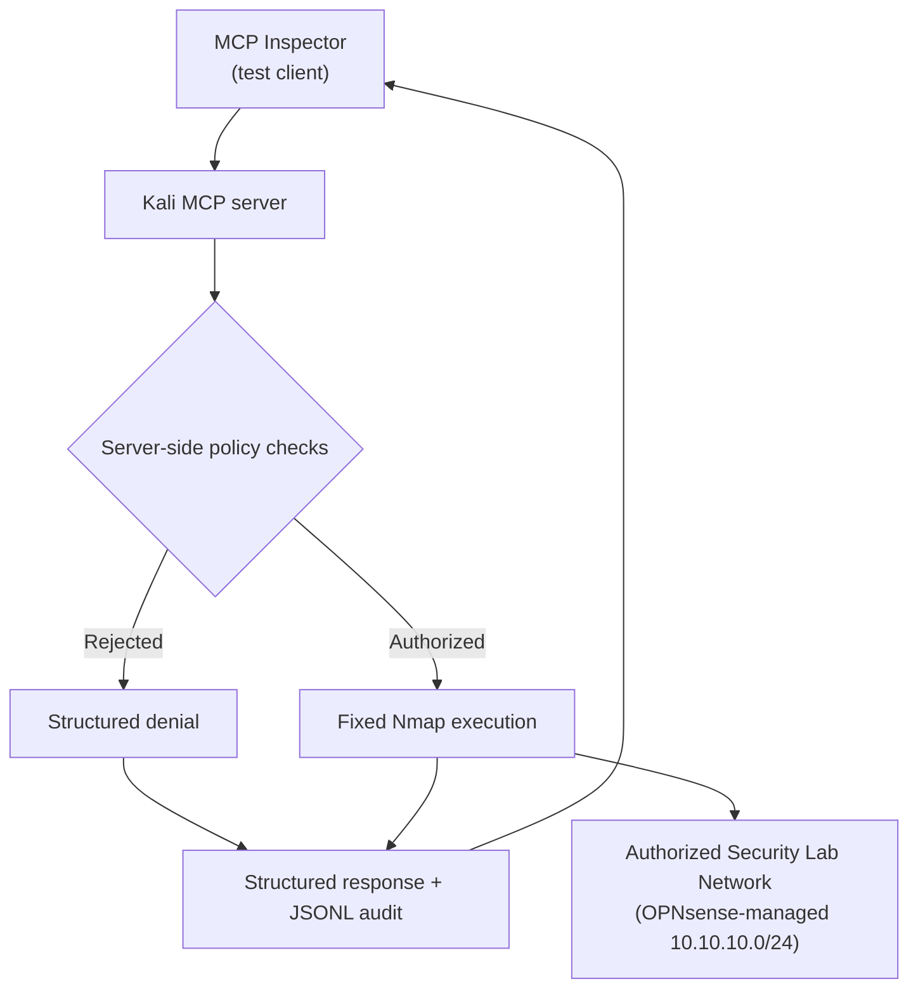

# Kali MCP Security Lab

A learning-focused project for building a safety-constrained Model Context Protocol (MCP) server that exposes selected Kali Linux and Nmap capabilities to MCP Inspector inside an authorized security lab network.

## Why We Built This

Connecting an AI assistant to Kali Linux is easy to imagine and dangerous to implement carelessly. A general-purpose shell tool would give the model far more authority than it needs. A typo, misunderstood request, or prompt-injection attempt could turn a learning exercise into an out-of-scope scan.

This project started with a more useful question:

> How can an MCP server expose real security tools while enforcing exactly which targets and operations are permitted?

The answer is a deliberately narrow MCP server. It exposes useful lab operations, but it never accepts arbitrary shell commands or user-controlled Nmap flags. The authorized network, tool behavior, port list, timeouts, and audit trail are enforced in code.

The goal is not simply to deploy an MCP server. It is to learn how to design, test, observe, and troubleshoot a trustworthy boundary between an AI system and security tooling.

## What You Will Learn

By completing the lab, you will practice:

- How MCP Inspector acts as a test client to discover, invoke, and validate tools exposed by an MCP server
- Why tool design is part of an AI system's security boundary
- Allowlisting versus trying to block every unsafe option
- Network-scope validation with Python's `ipaddress` module
- Safe subprocess execution without a shell
- Parsing structured Nmap XML instead of scraping terminal text
- Testing authorization, command construction, parsing, failures, and audit behavior
- Diagnosing a browser-specific Inspector connection failure
- Creating a structured JSONL audit trail for real tool calls

## Final Capabilities

The server exposes four MCP tools:

| Tool | Purpose | Enforced limit |
|---|---|---|
| `show_scope_policy` | Display the active policy | Read-only policy information |
| `validate_target` | Check a host or subnet | IPv4 targets inside `10.10.10.0/24` only |
| `discover_hosts` | Find live hosts | Fixed Nmap discovery command |
| `scan_common_ports` | Check common TCP ports | One authorized host and a fixed 14-port list |

It intentionally does **not** provide arbitrary commands, custom Nmap options, service/version detection, Nmap scripts, exploitation, credential operations, persistence, or destructive actions.

## Architecture and Trust Boundary



The critical design decision is that the MCP server is the enforcement point. Natural-language instructions can guide the model, but only server-side controls determine what actually runs.

## Safety Model

The implementation enforces these boundaries:

- The authorized network is fixed at `10.10.10.0/24`.
- Out-of-scope IPv4 targets and all IPv6 targets are rejected.
- Common-port scans accept exactly one host—not a subnet.
- Network and broadcast addresses are rejected as scan targets.
- Nmap is called by absolute path with a fixed argument list.
- No shell is invoked and no user-supplied command options are accepted.
- Discovery and scanning use a fixed 120-second execution timeout.
- Port results outside the allowlist are treated as invalid.
- Every policy check or operational call produces a structured audit event.
- Audit-write failure does not weaken policy enforcement or crash a safe operation.

Use this project only on systems you own or are explicitly authorized to test.

## Repository Guide

```text
.
├── kali_lab_server.py          # MCP tools and safety enforcement
├── test_kali_lab_server.py     # Unit tests for policy, parsing, and execution
├── test_audit_logging.py       # Isolated audit-behavior tests
├── test_mcp_integration.py     # MCP protocol integration tests
├── docs/
│   ├── learning-journey.md     # Build milestones and reasoning
│   └── troubleshooting.md      # Inspector/browser diagnosis
├── requirements.txt
├── .gitignore
└── LICENSE
```

The guide explains the system's behavior and design. It deliberately avoids a line-by-line explanation of the Python files so the learning path stays focused.

## Prerequisites

- Kali Linux
- Python 3 with virtual-environment support
- Nmap
- `jq` for formatting and filtering JSONL audit records
- Chromium for the validated MCP Inspector workflow
- Access to an isolated, authorized `10.10.10.0/24` lab network

Check the main system dependencies:

```bash
python3 --version
nmap --version
jq --version
```

`python3 --version` confirms Python is installed. `nmap --version` verifies that the scanner used by the bounded tools is available. `jq --version` confirms that the JSON-processing utility used by the audit-review examples is installed.

## Installation

Clone the repository and enter it:

```bash
git clone https://github.com/backyard-labs/kali-mcp-security-lab.git
cd kali-mcp-security-lab
```

The first command downloads the project. The second makes the repository the current working directory.

Create and activate an isolated Python environment:

```bash
python3 -m venv .venv
source .venv/bin/activate
```

The virtual environment keeps this project's Python packages separate from Kali's system-managed Python installation.

Install the pinned development dependencies:

```bash
python -m pip install --upgrade pip
python -m pip install -r requirements.txt
```

The first command updates the environment's package installer. The second installs MCP 2.0.0, its CLI support, `uv`, and `pytest`.

Confirm that the environment resolves the expected programs:

```bash
command -v python
command -v mcp
command -v uv
command -v nmap
```

The first three paths should point into `.venv`; Nmap should resolve to `/usr/bin/nmap`.

## Run the Automated Tests

```bash
python -m pytest -q
```

This runs the complete suite in quiet mode. The validated project result is:

```text
36 passed
```

The tests cover:

- Authorized and rejected hosts and networks
- IPv4-only and single-host restrictions
- Fixed command construction
- Nmap XML parsing and allowlist validation
- Timeouts, nonzero exits, and malformed output
- MCP protocol discovery and invocation
- Audit logging and audit-write failures

No live network scan is required for the automated suite; operational execution is mocked where appropriate.

## Use MCP Inspector

Start Inspector from the activated environment:

```bash
mcp dev kali_lab_server.py
```

This launches the MCP development server and prints a temporary tokenized localhost URL. Open the complete URL in Chromium.

Use the tools in this order:

1. Run `show_scope_policy` and confirm `10.10.10.0/24`.
2. Run `validate_target` with a known lab address.
3. Run `discover_hosts` with `10.10.10.0/24`.
4. Select one known authorized host other than Kali itself.
5. Run `scan_common_ports` against that host.
6. Review the tool result and corresponding audit event.

Stop Inspector with `Ctrl+C`. That ends the Inspector and MCP server processes and invalidates the temporary token for that instance.

## Review the Audit Trail

Operational events are appended to `kali_lab_audit.jsonl`. The file is intentionally excluded from Git because it can contain lab addresses and command history.

Format the most recent events:

```bash
tail -n 10 kali_lab_audit.jsonl | jq .
```

`tail` selects the newest ten JSONL records; `jq` formats each record for review.

Show only common-port scans:

```bash
jq 'select(.tool == "scan_common_ports")' kali_lab_audit.jsonl
```

Show rejected requests:

```bash
jq 'select(.authorized == false)' kali_lab_audit.jsonl
```

Each event records the UTC timestamp, MCP tool, target, authorization decision, fixed command when applicable, exit code, and duration.

## Validated End-to-End Result

The lab completed the full path:

```text
MCP Inspector
  -> server-side scope validation
  -> fixed Nmap execution
  -> structured MCP response
  -> persistent JSONL audit event
```

A controlled common-port scan of authorized host `10.10.10.101` successfully tested the fixed 14-port allowlist. The result and the exact enforced command were recorded in the operational audit log.

## The Most Useful Troubleshooting Lesson

During validation, MCP Inspector remained at **Connecting...** in Firefox even though the Python process and Inspector backend were healthy. Firefox's Network panel showed its long-lived `events` requests being aborted with `NS_BINDING_ABORTED`. Opening the same tokenized URL in Chromium connected immediately.

That sequence matters because it demonstrates evidence-based troubleshooting:

1. Verify the server process.
2. Verify listening ports.
3. Inspect logs.
4. Inspect browser network behavior.
5. Change one component at a time.

See [Troubleshooting MCP Inspector](docs/troubleshooting.md) for the diagnostic commands and reasoning.

## Where to Go Next

Treat this repository as version 1 of a controlled tool boundary. Good extensions would be:

- Make the authorized subnet configurable through a validated environment variable.
- Add log rotation and integrity protection.
- Add a dry-run mode that returns the fixed command without executing it.
- Connect a local AI client such as an Ollama-backed agent.
- Add new tools only when each can be expressed as a narrow schema with an explicit allowlist.

Avoid turning the project into a general shell bridge. Its educational value comes from keeping authority narrow, visible, testable, and auditable.

## License

Released under the [MIT License](LICENSE).
