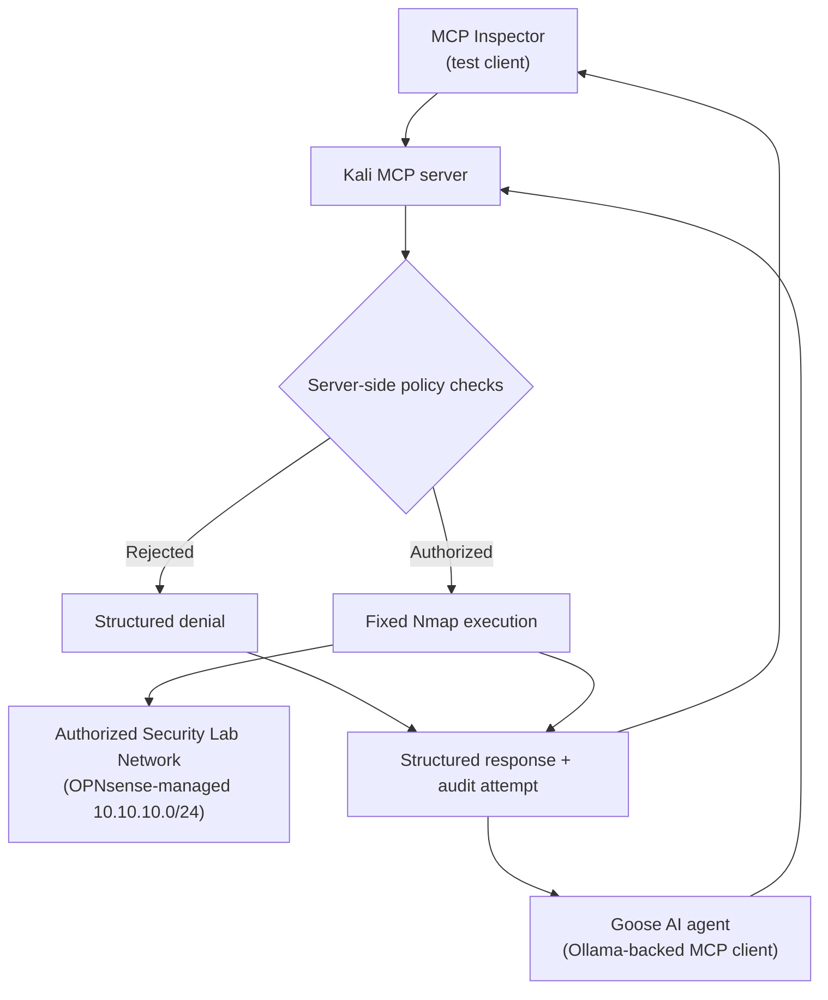

# Kali MCP Security Lab

> [!IMPORTANT]
> **Project status: Experimental educational lab**
>
> This repository is a learning project and is not production-ready. The MCP server and documented client workflows have been validated only in the isolated lab environment described in this repository. Do not deploy it on production networks or use it against systems you do not own or have explicit authorization to test.

A learning-focused project for building a safety-constrained Model Context Protocol (MCP) server that exposes selected Kali Linux and Nmap capabilities inside an authorized security lab network.

The server has been validated through two client paths:

- Direct protocol and tool testing with MCP Inspector
- AI-enabled MCP client testing with Goose backed by a Windows-hosted Ollama model

Both paths remain subject to the same server-side authorization and command restrictions.

## Why We Built This

Connecting an AI assistant to Kali Linux is easy to imagine and dangerous to implement carelessly. A general-purpose shell tool would give the model far more authority than it needs. A typo, misunderstood request, or prompt-injection attempt could turn a learning exercise into an out-of-scope scan.

This project started with a more useful question:

> How can an MCP server expose real security tools while enforcing exactly which targets and operations are permitted?

The answer is a deliberately narrow MCP server. It exposes useful lab operations, but it never accepts arbitrary shell commands or user-controlled Nmap flags. The authorized network, tool behavior, port list, and timeouts are enforced in code, while structured audit logging records operations when audit storage is available.

The goal is not simply to deploy an MCP server. It is to learn how to design, test, observe, and troubleshoot a trustworthy boundary between an AI system and security tooling.

## What You Will Learn

By completing the lab, you will practice:

- How MCP Inspector acts as a test client to discover, invoke, and validate tools exposed by an MCP server
- How to configure an Ollama-backed Goose agent to connect to the MCP server
- How an AI-enabled MCP client selects tools from conversational requests
- Why tool design is part of an AI system's security boundary
- Allowlisting versus trying to block every unsafe option
- Network-scope validation with Python's `ipaddress` module
- Safe subprocess execution without a shell
- Parsing structured Nmap XML instead of scraping terminal text
- Testing authorization, command construction, parsing, failures, and audit behavior
- Diagnosing a browser-specific Inspector connection failure
- Creating a structured JSONL audit trail for real tool calls
- Why the MCP server—not the AI model, client, or prompt—must remain the policy-enforcement point

## Current Capabilities

The server exposes four MCP tools:

| Tool | Purpose | Enforced limit |
|---|---|---|
| `show_scope_policy` | Display the active policy | Read-only policy information |
| `validate_target` | Check a host or subnet | IPv4 targets inside `10.10.10.0/24` only |
| `discover_hosts` | Find live hosts | Fixed Nmap discovery command |
| `scan_common_ports` | Check common TCP ports | One authorized host and a fixed 14-port list |

It intentionally does **not** provide arbitrary commands, custom Nmap options, service/version detection, Nmap scripts, exploitation, credential operations, persistence, or destructive actions.

## Architecture and Trust Boundary



The two validated client paths serve different purposes:

- MCP Inspector provides direct inspection and testing of MCP tool schemas, arguments, responses, and protocol behavior.
- Goose provides an AI-enabled MCP client that can interpret a conversational request and select an appropriate exposed tool.
- Ollama supplies the local language model used by Goose. Ollama itself is not the MCP client.

The critical design decision is that the MCP server is the enforcement point. Natural-language instructions can guide an agent, but only server-side controls determine what actually runs.

## Safety Model

The implementation enforces these boundaries:

- The authorized network is fixed at `10.10.10.0/24`.
- Out-of-scope IPv4 targets and all IPv6 targets are rejected.
- Common-port scans accept exactly one host—not a subnet.
- Network and broadcast addresses are rejected as scan targets.
- Nmap is called by absolute path with a fixed argument list.
- No shell is invoked and no user-supplied command options are accepted.
- Discovery and scanning use a fixed 120-second execution timeout.
- Port results outside the allowlist are treated as invalid.
- The server attempts to record every policy check and operational call as a structured JSONL audit event.
- In the current experimental implementation, an audit-write failure does not interrupt tool operation or weaken the separately enforced target and command restrictions.
- MCP clients and language models cannot alter the authorized subnet, fixed commands, port allowlist, timeout, or audit behavior.

The server currently uses local standard input/output (`stdio`) transport. It does not independently authenticate the MCP client; access is governed by which local processes and users are permitted to start and communicate with the server. Authentication and multi-user remote access are outside the scope of this educational version.

Use this project only on systems you own or are explicitly authorized to test.

## Repository Guide

```text
.
├── .github/
│   ├── ISSUE_TEMPLATE/
│   │   ├── bug_report.yml
│   │   ├── config.yml
│   │   ├── documentation.yml
│   │   └── feature_request.yml
│   ├── workflows/
│   │   └── ci.yml
│   └── pull_request_template.md
├── docs/
│   ├── deployment-guide.md
│   ├── goose-ollama-integration.md
│   ├── learning-journey.md
│   └── troubleshooting.md
├── .gitignore
├── CODE_OF_CONDUCT.md
├── CONTRIBUTING.md
├── LICENSE
├── README.md
├── SECURITY.md
├── kali_lab_server.py
├── requirements.txt
├── test_audit_logging.py
├── test_kali_lab_server.py
└── test_mcp_integration.py
```

The repository supports two learning paths:

1. **Core path:** Install the server, run the automated tests, and validate all four tools directly with MCP Inspector.
2. **Advanced path:** Configure Goose as an AI-enabled MCP client backed by a local Ollama model, then perform the staged validation sequence against the same constrained MCP server.

See the [Deployment Guide](docs/deployment-guide.md) for complete Kali installation, testing, MCP Inspector validation, audit review, and shutdown instructions.

The core path teaches the MCP protocol and security boundary without requiring an AI agent. The advanced path demonstrates that conversational tool selection remains subject to the same server-side controls.

The documentation focuses on the security decisions, data flow, and important implementation patterns rather than explaining every Python statement individually. The supporting guides connect the major functions to the controls and tests that verify them.

See [Goose and Ollama Integration](docs/goose-ollama-integration.md) for the validated AI-enabled client architecture, installation, configuration, staged testing, audit review, shutdown, resume, and troubleshooting procedures.

## Prerequisites

### Core MCP Inspector path

- Kali Linux
- Python 3 with virtual-environment support
- Nmap
- `jq` for formatting and filtering JSONL audit records
- Node.js, npm, and `npx`
- Chromium for the validated MCP Inspector workflow
- Access to an isolated, authorized `10.10.10.0/24` lab network

### Goose and Ollama path

In addition to the core prerequisites:

- Goose installed on Kali
- A reachable Ollama installation
- A compatible local Ollama model
- Network connectivity between Kali and the Ollama host
- Host firewall rules restricted to the required Ollama connection

Check the main Kali dependencies:

```bash
python3 --version
nmap --version
jq --version
node --version
npm --version
npx --version
```

`python3 --version` confirms Python is installed. `nmap --version` verifies that the scanner used by the bounded tools is available. `jq --version` confirms that the JSON-processing utility used by the audit-review examples is installed. Node.js, npm, and `npx` are required for MCP Inspector.

## Installation

Clone the repository and enter it:

```bash
git clone https://github.com/backyard-labs/kali-mcp-security-lab.git
cd kali-mcp-security-lab
```

The first command downloads the project. The second makes the repository the current working directory.

Create and activate an isolated Python environment:

```bash
python3 -m venv .venv
source .venv/bin/activate
```

The virtual environment keeps this project's Python packages separate from Kali's system-managed Python installation.

Install the version-constrained development dependencies:

```bash
python -m pip install --upgrade pip
python -m pip install -r requirements.txt
```

The first command updates the environment's package installer. The second installs MCP 2.0.0 with its CLI support and compatible versions of `uv` and `pytest` from the ranges defined in `requirements.txt`.

Confirm that the environment resolves the expected programs:

```bash
command -v python
command -v mcp
command -v uv
command -v nmap
```

The first three paths should point into `.venv`; Nmap should resolve to `/usr/bin/nmap`.

## Run the Automated Tests

```bash
python -m pytest -q
```

This runs the complete suite in quiet mode. The validated project result is:

```text
36 passed
```

The tests cover:

- Authorized and rejected hosts and networks
- IPv4-only and single-host restrictions
- Fixed command construction
- Nmap XML parsing and allowlist validation
- Timeouts, nonzero exits, and malformed output
- MCP protocol discovery and invocation
- Audit logging and audit-write failures

No live network scan is required for the automated suite; operational execution is mocked where appropriate.

The 36 automated tests validate the Python implementation and MCP protocol behavior. They do not replace manual validation of MCP Inspector, Goose, Ollama, networking, routing, or live authorized lab operations.

## Use MCP Inspector

Start Inspector from the activated environment:

```bash
mcp dev kali_lab_server.py
```

This launches the MCP development server and prints a temporary tokenized localhost URL. Open the complete URL in Chromium.

Use the tools in this order:

1. Run `show_scope_policy` and confirm `10.10.10.0/24`.
2. Run `validate_target` with a known lab address.
3. Run `validate_target` with an address outside the authorized network and confirm rejection.
4. Run `discover_hosts` with `10.10.10.0/24`.
5. Select one known authorized host other than Kali itself.
6. Run `scan_common_ports` against that host.
7. Submit a subnet or out-of-scope target to `scan_common_ports` and confirm rejection.
8. Review the tool results and corresponding audit events.

Stop Inspector with `Ctrl+C`. That ends the Inspector and MCP server processes and invalidates the temporary token for that instance.

## Use the Server With Goose and Ollama

The advanced workflow uses Goose as the AI-enabled MCP client and Ollama for local language-model inference.

The validated integration path is:

```text
Ollama local model
  -> Goose AI agent and MCP client
  -> Kali MCP server
  -> server-side policy enforcement
  -> constrained Nmap tools
  -> structured result and JSONL audit attempt
```

MCP Inspector and Goose serve different purposes:

- MCP Inspector directly displays tool schemas, arguments, responses, and protocol behavior.
- Goose allows a user to request an authorized security task conversationally and lets the agent select and invoke the appropriate MCP tool.
- Ollama supplies the local model used by Goose; Ollama itself is not the MCP client.

The MCP server remains the security-enforcement point. Goose and the model can request tool use, but they cannot change the authorized subnet, fixed Nmap commands, port allowlist, timeout, or audit behavior.

The Goose and Ollama workflow was reproduced successfully in the documented isolated lab environment. The validation confirmed:

- Kali could reach the Windows-hosted Ollama API.
- Goose could use the configured Ollama model.
- Goose could start the Kali MCP server as a local `stdio` extension.
- Goose discovered all four constrained MCP tools.
- Authorized targets were accepted.
- Unauthorized and invalid targets were rejected.
- Authorized host discovery and common-port scanning remained subject to server-side controls.
- JSONL audit evidence was reviewed for allowed and rejected operations.

See [Goose and Ollama Integration](docs/goose-ollama-integration.md) for the complete installation and validation procedure.

## Review the Audit Trail

Operational events are appended to `kali_lab_audit.jsonl` when audit storage is available. The file is intentionally excluded from Git because it can contain lab addresses and command history.

Format the most recent events:

```bash
tail -n 10 kali_lab_audit.jsonl | jq .
```

`tail` selects the newest ten JSONL records; `jq` formats each record for review.

Show only common-port scans:

```bash
jq 'select(.tool == "scan_common_ports")' kali_lab_audit.jsonl
```

Show rejected requests:

```bash
jq 'select(.authorized == false)' kali_lab_audit.jsonl
```

When an event is successfully written, it records the UTC timestamp, MCP tool, target, authorization decision, fixed command when applicable, exit code, and duration.

In the current experimental implementation, an audit-storage failure does not stop tool execution. This fail-open audit behavior is a documented limitation and would need to be redesigned for production use where guaranteed accountability is required.

## Validation Status

### Automated validation

The complete automated test suite passed:

```text
36 passed
```

The suite validates policy enforcement, target handling, fixed command construction, structured result parsing, error behavior, audit behavior, and MCP protocol integration.

### MCP Inspector validation

The direct MCP Inspector path was validated:

```text
MCP Inspector
  -> Kali MCP server
  -> server-side scope validation
  -> fixed Nmap execution
  -> structured MCP response
  -> JSONL audit event when audit storage is available
```

MCP Inspector was used to discover and invoke all four tools directly.

During controlled validation, a common-port scan of authorized example host `10.10.10.101` tested the fixed 14-port allowlist. Learners must replace this example with an authorized target that exists in their own isolated `10.10.10.0/24` lab. The result and exact enforced command were recorded in the operational audit log.

### Goose and Ollama validation

The Goose and Ollama end-to-end path was also reproduced successfully:

```text
User request
  -> Goose on Kali
  -> Windows-hosted Ollama model
  -> Kali MCP server
  -> server-side authorization
  -> constrained tool execution or rejection
  -> structured response
  -> JSONL audit attempt
```

The recorded validation environment was:

| Component | Validated value |
|---|---|
| Validation date | `2026-08-02` |
| Kali distribution | `Kali GNU/Linux Rolling` |
| Kali version | `2026.2` |
| Python | `3.13.12` |
| Goose | `1.44.0` |
| Ollama | `0.30.8` |
| Ollama model | `mistral:7b` |
| Authorized network | `10.10.10.0/24` |
| Authorized live-scan target | `10.10.10.101` |
| Automated tests | `36 passed` |
| MCP tools discovered | All four |
| Unauthorized target rejection | Confirmed |
| Audit evidence review | Confirmed |

The tested Kali working directory was:

```text
/home/your-username/mcp-lab/kali-tool-server
```

The validated MCP Python interpreter and server paths were:

```text
/home/your-username/mcp-lab/kali-tool-server/.venv/bin/python
/home/your-username/mcp-lab/kali-tool-server/kali_lab_server.py
```

The audit log resolved to:

```text
/home/your-username/mcp-lab/kali-tool-server/kali_lab_audit.jsonl
```

The files tested on Kali were stored in a regular project directory rather than a Git clone. Therefore, the validation was not associated with a recorded Git commit. The validated test files were subsequently verified and uploaded to this repository.

Validation in this specific environment does not guarantee that every version, model, operating system, network topology, or future dependency combination will behave identically. Follow the documented staged checks and record the actual values observed in your own environment.

## The Most Useful Troubleshooting Lesson

During validation, MCP Inspector remained at **Connecting...** in Firefox even though the Python process and Inspector backend were healthy. Firefox's Network panel showed its long-lived `events` requests being aborted with `NS_BINDING_ABORTED`. Opening the same tokenized URL in Chromium connected immediately.

That sequence matters because it demonstrates evidence-based troubleshooting:

1. Verify the server process.
2. Verify listening ports.
3. Inspect logs.
4. Inspect browser network behavior.
5. Change one component at a time.

See [Troubleshooting MCP Inspector](docs/troubleshooting.md) for the diagnostic commands and reasoning.

## Documentation

Use these guides for the complete procedures:

- [Deployment Guide](docs/deployment-guide.md) — Kali installation, automated tests, MCP Inspector validation, audit review, shutdown, and resume
- [Goose and Ollama Integration](docs/goose-ollama-integration.md) — Goose installation, Ollama connectivity, MCP extension configuration, staged validation, and troubleshooting
- [Troubleshooting](docs/troubleshooting.md) — MCP Inspector and client-connection diagnosis
- [Learning Journey](docs/learning-journey.md) — project milestones, design decisions, and lessons learned
- [Contributing](CONTRIBUTING.md) — contribution workflow and project expectations
- [Security Policy](SECURITY.md) — security limitations and vulnerability-reporting guidance

## Current Limitations

This project remains an experimental educational lab rather than a production security service.

Current limitations include:

- The authorized network is hard-coded as `10.10.10.0/24`.
- The server uses local `stdio` transport.
- The server does not independently authenticate MCP clients.
- Remote and multi-user MCP deployment is not supported.
- Audit-write failures are fail-open.
- Audit rotation, retention, and integrity protection are not implemented.
- The validated Goose and Ollama result applies to the recorded lab environment and versions.
- The server has not undergone an independent production security assessment.
- The project does not provide exploitation, credential, persistence, or general shell capabilities.

The presence of automated tests and a GitHub Actions workflow does not mean the application is production-ready. These controls help detect regressions in the educational implementation.

## Where to Go Next

For learners using this repository:

- Follow the core deployment guide and validate the server with MCP Inspector.
- Follow the Goose and Ollama guide to reproduce the AI-enabled MCP client workflow.
- Record the actual software versions, network values, paths, and validation results from your environment.
- Compare client responses with server-generated audit evidence.
- Experiment only inside an isolated, explicitly authorized lab.
- Add new tools only when each can be expressed as a narrow schema with an explicit allowlist.

Possible future engineering improvements include:

- Make the authorized subnet configurable through a strictly validated configuration mechanism.
- Add log rotation, retention, and integrity protection.
- Add a dry-run mode that returns the fixed command without executing it.
- Expand negative, malformed-input, and resource-exhaustion tests.
- Strengthen dependency, lint, and security automation.
- Add controlled packaging and versioned releases.
- Evaluate additional safety-constrained Goose workflows.
- Perform an independent security review before considering any production use.

Avoid turning the project into a general shell bridge. Its educational and security value comes from keeping authority narrow, visible, testable, and auditable.

## Responsible Use

This project must be used only:

- In an isolated lab environment
- Against systems you own
- Against systems for which you have explicit authorization
- For education, testing, and defensive security research

Do not use this project to scan, probe, disrupt, exploit, or access third-party systems without permission.

The user is responsible for complying with applicable laws, organizational policies, and authorization boundaries.

## License

Released under the [MIT License](LICENSE).
