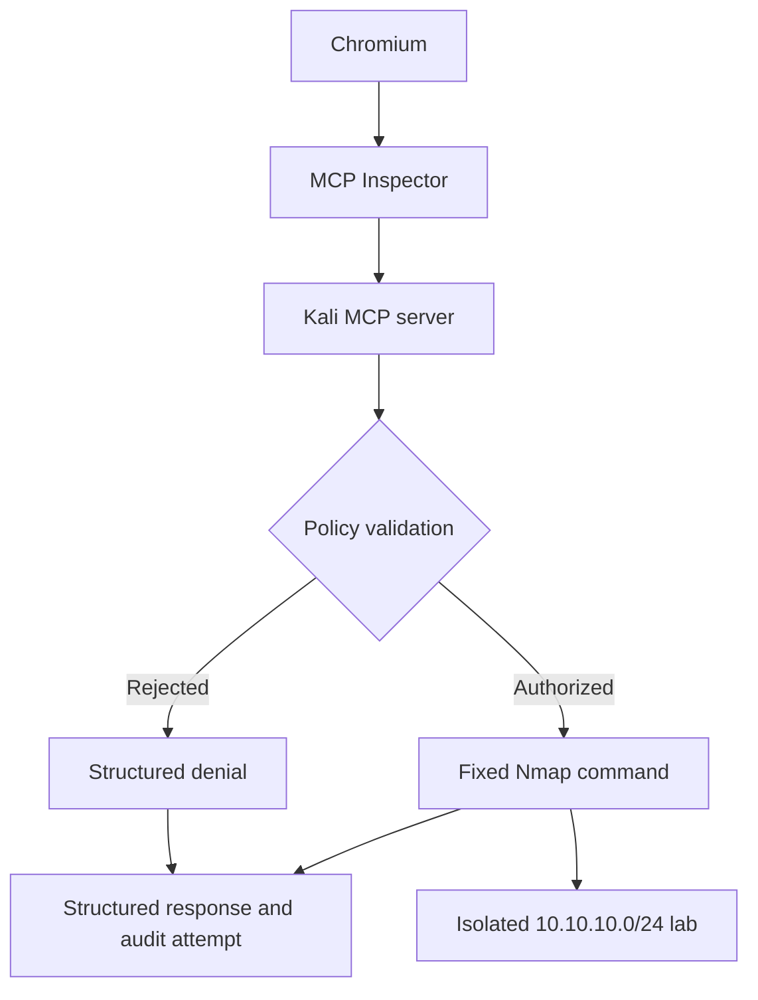

# Deployment Guide

## Purpose

This guide walks you through deploying and validating the core Kali MCP Security Lab from a Kali Linux virtual machine.

By the end, you will have:

- Installed the required system software.
- Cloned the repository.
- Created an isolated Python environment.
- Installed the project dependencies.
- Run all 36 automated tests.
- Started the MCP server through MCP Inspector.
- Discovered all four MCP tools and safely invoked those appropriate for the authorized lab environment.
- Confirmed that an authorized target is accepted.
- Confirmed that an unauthorized target is rejected.
- Performed an optional authorized lab scan.
- Reviewed the JSONL audit evidence.
- Shut down the lab safely.

This guide covers the core MCP Inspector learning path. Goose and Ollama are optional advanced components documented separately.

> [!IMPORTANT]
> Use this project only in an isolated lab and only against systems you own or are explicitly authorized to test. Do not connect the authorized lab network to a production, corporate, public, or otherwise unauthorized network.

## Required Skill Level

This guide assumes basic Linux knowledge. You should be comfortable:

- Opening a terminal.
- Entering shell commands.
- Navigating directories with `cd`.
- Recognizing file paths.
- Using `sudo` to install packages.
- Reading command output and basic error messages.

You do not need prior experience building an MCP server or writing Python.

## What the Lab Teaches

The project demonstrates how an MCP server can expose selected security operations without giving an AI client general shell access.

The server exposes four narrow tools:

| Tool | Learning purpose |
|---|---|
| `show_scope_policy` | Inspect the server-enforced authorization policy |
| `validate_target` | Test whether a host or subnet is inside the authorized scope |
| `discover_hosts` | Perform fixed Nmap host discovery |
| `scan_common_ports` | Scan a fixed 14-port list on one authorized host |

The user or MCP client supplies a target—not a command. The server validates the target and constructs the permitted Nmap command itself.

## Core Architecture



MCP Inspector is the test client. It lets you inspect the exposed tool schemas, submit structured arguments, and review the returned results.

The MCP server is the security-enforcement point. Inspector cannot change the authorized subnet, Nmap arguments, permitted ports, timeout, or tool behavior.

## Validated Network Model

The repository is currently designed for this isolated network:

| Component | Validated value |
|---|---|
| Authorized network | `10.10.10.0/24` |
| OPNsense lab gateway | `10.10.10.1` |
| Kali lab interface | An address inside `10.10.10.0/24` |
| Authorized scan target | A disposable lab VM inside `10.10.10.0/24` |
| Validated example target | `10.10.10.101` |

The example address `10.10.10.101` may not exist in your environment. Use it only if that address belongs to a disposable system you own or are authorized to test.

A more detailed explanation of the VMware and OPNsense network design will be provided in the separate network setup guide.

## Minimum Requirements

### Virtual machine

Recommended minimum resources for Kali:

| Resource | Suggested minimum |
|---|---:|
| Virtual CPUs | 2 |
| Memory | 4 GB |
| Free disk space | 10 GB |
| Network | Access to the isolated `10.10.10.0/24` lab |
| Internet access | Required during package and Inspector installation |

These values are practical starting points rather than strict application requirements.

### Required software

The core path requires:

- Kali Linux
- Git
- Python 3.10 or newer
- Python virtual-environment support
- `pip`
- Nmap
- `jq`
- Node.js
- npm and `npx`
- Chromium
- Internet access during installation

The MCP Python SDK requires Python 3.10 or newer. MCP Inspector is a Node.js application, so the `mcp dev` command requires `npx` to be available.

Official references:

- [MCP Python SDK](https://py.sdk.modelcontextprotocol.io/)
- [MCP Inspector](https://modelcontextprotocol.io/docs/tools/inspector)

## Before You Begin

Confirm that:

- Kali is connected to the isolated lab network.
- The lab interface has an address inside `10.10.10.0/24`.
- OPNsense is reachable at `10.10.10.1`.
- You know which disposable VM, if any, you are authorized to scan.
- You are logged into a normal Kali user account with `sudo` access.

Do not continue to live scanning if you cannot identify an explicitly authorized target.

You can still install the project, run all automated tests, start Inspector, display the policy, and test target validation without performing a live scan.

## 1. Inspect the Kali Network

Display the interfaces and assigned addresses:

```bash
ip -brief address
```

Look for an interface with an address beginning with `10.10.10.` and a `/24` prefix.

Example:

```text
eth1             UP             10.10.10.50/24
```

The interface name and host address may differ.

Display the routing table:

```bash
ip route
```

You should see a route for the authorized lab network similar to:

```text
10.10.10.0/24 dev eth1 proto kernel scope link src 10.10.10.50
```

Check the path to the OPNsense gateway:

```bash
ip route get 10.10.10.1
```

The result should identify the lab interface rather than an Internet-facing interface.

Test gateway reachability:

```bash
ping -c 3 10.10.10.1
```

A successful result normally contains replies and `0% packet loss`.

> [!NOTE]
> Some systems intentionally block ping. A failed ping does not always prove the route is incorrect. Compare the result with `ip route` and `ip route get 10.10.10.1`.

### Stop condition

Do not perform live discovery or scanning if:

- Kali has no interface connected to `10.10.10.0/24`.
- Traffic for `10.10.10.0/24` uses an unexpected interface.
- The network is not an isolated, authorized lab.
- You cannot identify the systems connected to it.

Resolve the network configuration before proceeding to live tool execution. Installation and automated tests can still be completed safely.

## 2. Update Kali’s Package Information

Refresh the local package index:

```bash
sudo apt update
```

This retrieves current package information from the configured Kali repositories.

Expected result:

- Repository metadata downloads successfully.
- The command finishes without an unresolved repository error.

If the command fails:

1. Confirm Kali has Internet access.
2. Check the system time with `timedatectl`.
3. Review the configured repositories.
4. Resolve the package-manager error before installing dependencies.

Updating package information does not upgrade every installed package.

## 3. Install the System Packages

Install the packages required for the core learning path:

```bash
sudo apt install -y \
  git \
  python3 \
  python3-venv \
  python3-pip \
  nmap \
  jq \
  nodejs \
  npm \
  chromium \
  curl \
  ca-certificates
```

These packages provide:

| Package | Purpose |
|---|---|
| `git` | Clone and inspect the repository |
| `python3` | Run the MCP server and tests |
| `python3-venv` | Create the project virtual environment |
| `python3-pip` | Install Python packages inside the environment |
| `nmap` | Execute the server’s constrained network operations |
| `jq` | Format and filter JSONL audit events |
| `nodejs` | Run MCP Inspector |
| `npm` | Provides npm tooling, including `npx` |
| `chromium` | Validated browser for MCP Inspector |
| `curl` | Perform connectivity tests |
| `ca-certificates` | Validate HTTPS connections during installation |

Expected result:

- The command completes without package errors.
- Already-installed packages may be reported as current.
- Additional dependency packages may be installed automatically.

## 4. Verify the System Software

Run:

```bash
git --version
python3 --version
nmap --version
jq --version
node --version
npm --version
npx --version
chromium --version
```

Confirm that every command returns a version rather than `command not found`.

Python must be version 3.10 or newer.

Confirm that Nmap is installed at the absolute path used by the server:

```bash
command -v nmap
```

Expected result:

```text
/usr/bin/nmap
```

The server intentionally uses `/usr/bin/nmap` instead of relying on shell path lookup.

### If `npx` is missing

Confirm npm is installed:

```bash
dpkg -s npm
```

If it is not installed, run:

```bash
sudo apt install npm
```

Then open a new terminal and repeat:

```bash
npx --version
```

Do not continue to MCP Inspector until `npx` works.

## 5. Choose the Installation Directory

Return to your home directory:

```bash
cd
```

Confirm the location:

```bash
pwd
```

The output should normally resemble:

```text
/home/your-username
```

The remaining instructions assume the repository will be cloned under your home directory.

## 6. Clone the Repository

Clone the project:

```bash
git clone https://github.com/backyard-labs/kali-mcp-security-lab.git
```

Enter the repository:

```bash
cd kali-mcp-security-lab
```

Confirm the current directory:

```bash
pwd
```

Confirm the expected files exist:

```bash
ls
```

You should see files including:

```text
README.md
kali_lab_server.py
requirements.txt
test_audit_logging.py
test_kali_lab_server.py
test_mcp_integration.py
docs
```

Confirm the configured Git remote:

```bash
git remote -v
```

The output should reference:

```text
https://github.com/backyard-labs/kali-mcp-security-lab.git
```

### If the repository directory already exists

Do not clone a second copy over it.

Enter the existing directory:

```bash
cd ~/kali-mcp-security-lab
```

Inspect its status:

```bash
git status
```

Do not discard local changes. If this is your own unmodified learning copy, retrieve the latest committed changes with:

```bash
git pull --ff-only
```

If Git reports local changes or a branch conflict, stop and review them before continuing.

## 7. Create the Python Virtual Environment

From the repository root, create the environment:

```bash
python3 -m venv .venv
```

This creates a project-specific Python installation under `.venv`.

Activate it:

```bash
source .venv/bin/activate
```

The shell prompt should normally begin with:

```text
(.venv)
```

Confirm which Python executable is active:

```bash
command -v python
```

Expected pattern:

```text
/home/your-username/kali-mcp-security-lab/.venv/bin/python
```

Confirm the Python version again:

```bash
python --version
```

### If virtual-environment creation fails

If the error mentions `ensurepip` or missing virtual-environment support, run:

```bash
sudo apt install python3-venv
```

Then remove only the incomplete project environment:

```bash
rm -rf .venv
```

Recreate and reactivate it:

```bash
python3 -m venv .venv
source .venv/bin/activate
```

Only remove `.venv` when you are inside the repository and have confirmed it is the incomplete project environment.

## 8. Install the Python Dependencies

Upgrade `pip` inside the active virtual environment:

```bash
python -m pip install --upgrade pip
```

Install the repository requirements:

```bash
python -m pip install -r requirements.txt
```

The requirements install:

- MCP 2.0.0 with its command-line tools.
- A compatible pytest 8.x release.
- A compatible uv 0.8.x release.

Confirm the installed package constraints:

```bash
python -m pip check
```

Expected result:

```text
No broken requirements found.
```

Verify the project tools:

```bash
command -v python
command -v pip
command -v mcp
command -v uv
```

All four paths should point inside the repository’s `.venv` directory.

Confirm the important versions:

```bash
python --version
mcp version
uv --version
python -m pytest --version
```

If `mcp version` is not recognized by the installed CLI, confirm the command itself is available with:

```bash
mcp --help
```

## 9. Inspect the Project Before Running It

Display the configured authorization boundary:

```bash
grep 'AUTHORIZED_NETWORK' kali_lab_server.py
```

The output should include:

```text
AUTHORIZED_NETWORK = ipaddress.ip_network("10.10.10.0/24")
```

Display the Nmap executable references:

```bash
grep '"/usr/bin/nmap"' kali_lab_server.py
```

Display the server’s MCP tools:

```bash
grep -B 1 '^def \(show_scope_policy\|validate_target\|discover_hosts\|scan_common_ports\)' kali_lab_server.py
```

This confirms that the server exposes narrow Python functions rather than a general command-execution tool.

Do not change the authorized network merely to make a test pass. Alternate isolated subnets require coordinated implementation and test changes, which will be explained separately.

## 10. Run the Automated Tests

Run the complete suite:

```bash
python -m pytest -q
```

Expected result:

```text
36 passed
```

The exact execution time may differ.

The automated tests verify:

- Authorized host and subnet validation.
- Rejection of out-of-scope targets.
- IPv6 rejection.
- Single-host scan restrictions.
- Rejection of network and broadcast addresses.
- Fixed Nmap command construction.
- Fixed common-port enforcement.
- Nmap XML parsing.
- Timeout and process-error handling.
- Audit behavior, including write failures.
- MCP tool discovery and invocation.

The test suite mocks operational execution where appropriate. Running the automated tests does not require a live network scan.

### If tests fail

Run the suite with more detail:

```bash
python -m pytest -vv
```

Confirm that:

```bash
command -v python
```

points into `.venv`.

Then confirm the dependencies:

```bash
python -m pip check
```

Do not continue to live tool validation until all tests pass or the failure is understood.

## 11. Start MCP Inspector

MCP Inspector is a Node.js application. The `mcp dev` command uses `npx` to launch it.

The first launch may download the Inspector package from the npm registry and can take longer than later launches.

Start Inspector:

```bash
mcp dev kali_lab_server.py
```

Expected behavior:

1. The terminal displays Inspector startup information.
2. A tokenized localhost URL is printed.
3. Inspector may open automatically.
4. If it does not open automatically, copy the complete URL into Chromium.

The URL will resemble:

```text
http://localhost:6274/?MCP_PROXY_AUTH_TOKEN=temporary-value
```

The exact port and token may differ.

> [!IMPORTANT]
> Open the complete tokenized URL. Do not share the token or include it in screenshots, documentation, issues, or commits.

If the system opens Firefox automatically, copy the complete URL and open it in Chromium:

```bash
chromium
```

Keep the terminal running while you use Inspector.

## 12. Connect Inspector to the Server

In MCP Inspector:

1. Confirm that the transport is standard input/output.
2. Confirm that the server connects successfully.
3. Open the **Tools** section.
4. Select the option to list or refresh the available tools.

You should see exactly these four project tools:

```text
show_scope_policy
validate_target
discover_hosts
scan_common_ports
```

If the tools do not appear:

- Confirm the `mcp dev` terminal is still running.
- Confirm the complete tokenized URL was opened.
- Confirm you used Chromium.
- Review [Troubleshooting MCP Inspector](troubleshooting.md).
- Do not weaken or rewrite the server’s security controls to fix a client connection problem.

## 13. Display the Scope Policy

Select:

```text
show_scope_policy
```

This tool requires no target.

Invoke it and confirm the response includes:

```text
authorized_network: 10.10.10.0/24
```

It should also identify:

- Permitted target validation.
- Fixed host discovery.
- Fixed common-port scanning.
- Prohibition of arbitrary shell commands.
- Prohibition of custom Nmap options.
- Prohibition of exploitation and credential operations.

### Learning checkpoint

This call demonstrates that an MCP client can inspect the active policy, but it cannot modify the policy.

No Nmap command should execute.

## 14. Validate an Authorized Target

Select:

```text
validate_target
```

Enter an address inside the authorized lab, such as:

```text
10.10.10.101
```

Use that address only as a validation example unless it belongs to an authorized lab VM.

Invoke the tool.

Expected result:

```text
authorized: true
authorized_network: 10.10.10.0/24
```

Target validation does not execute Nmap. It only applies the server’s scope policy.

You can also validate the authorized subnet:

```text
10.10.10.0/24
```

Expected result:

```text
authorized: true
```

## 15. Validate an Unauthorized Target

Using `validate_target`, enter:

```text
192.168.1.10
```

Expected result:

```text
authorized: false
```

The reason should state that the target must be inside:

```text
10.10.10.0/24
```

No Nmap command should execute.

### Learning checkpoint

A rejected request is a successful security test. It demonstrates that the server—not Inspector and not a natural-language prompt—controls the authorization boundary.

## 16. Review the Initial Audit Evidence

Keep Inspector running.

Open a second terminal and enter the repository:

```bash
cd ~/kali-mcp-security-lab
```

The audit file is written relative to the server’s working directory, so it should appear in the repository root.

Confirm that it exists:

```bash
ls -l kali_lab_audit.jsonl
```

Format the most recent events:

```bash
tail -n 10 kali_lab_audit.jsonl | jq .
```

Look for events associated with:

```text
show_scope_policy
validate_target
```

The rejected validation should include:

```text
"authorized": false
```

The authorized validation should include:

```text
"authorized": true
```

Because these tools do not start Nmap, their `command` field should be `null`.

> [!NOTE]
> The experimental implementation attempts to write each audit event. Audit-write failure does not interrupt otherwise safe tool operation, so absence of an event must be investigated rather than treated as proof that no tool call occurred.

## 17. Optional Live Host Discovery

Complete this section only if `10.10.10.0/24` is your isolated, authorized lab network.

Select:

```text
discover_hosts
```

Enter:

```text
10.10.10.0/24
```

Invoke the tool.

The server constructs this fixed command:

```bash
/usr/bin/nmap \
  -sn \
  -n \
  --max-retries 1 \
  --host-timeout 10s \
  10.10.10.0/24
```

Inspector does not supply these Nmap flags. They are constructed by the server.

Expected response characteristics:

- `authorized` is `true`.
- `target` is `10.10.10.0/24`.
- `command_policy` identifies fixed Nmap host discovery.
- `exit_code` is normally `0`.
- `stdout` contains the Nmap discovery result.
- `stderr` is normally empty.

Discovery results depend on the systems currently running and reachable in the lab.

### Negative discovery test

You may safely test the boundary by submitting:

```text
192.168.1.0/24
```

Expected result:

- The request is rejected.
- `authorized` is `false`.
- No Nmap process is started.

## 18. Identify an Authorized Scan Target

Before scanning ports, choose one disposable host returned by discovery.

Do not select:

- `10.10.10.0`, which is the network address.
- `10.10.10.255`, which is the broadcast address.
- A subnet or CIDR range.
- A production system.
- A system you do not own or lack permission to test.
- Kali itself unless scanning it is an intentional lab exercise.

Confirm the route to the selected host from a terminal:

```bash
ip route get 10.10.10.101
```

Replace `10.10.10.101` with your actual authorized target.

The route should use the isolated lab interface.

## 19. Optional Common-Port Scan

Select:

```text
scan_common_ports
```

Enter one authorized IPv4 host, for example:

```text
10.10.10.101
```

Replace the example with your actual authorized target.

Invoke the tool.

The server performs a TCP connect scan using this fixed 14-port allowlist:

```text
21, 22, 23, 25, 53, 80, 110, 139, 443, 445, 3306, 5432, 5900, 8080
```

Expected response fields include:

- `authorized`
- `target`
- `scan_type`
- `ports_tested`
- `open_port_count`
- `open_ports`
- `command_policy`
- `exit_code`
- `stderr`

A result containing zero open ports can still be successful. It means none of the fixed allowed ports were reported open.

The server—not the client—adds:

- TCP connect scanning.
- Disabled DNS resolution.
- Host discovery bypass for the selected host.
- Open-port filtering.
- Retry limits.
- Host timeout.
- The fixed port list.
- XML output.

### Negative single-host test

Submit this to `scan_common_ports`:

```text
10.10.10.0/24
```

Expected result:

- The request is rejected.
- The response explains that the tool accepts one IPv4 host rather than a subnet.
- No Nmap process is started.

### Network-address test

Submit:

```text
10.10.10.0
```

Expected result:

- The request is rejected because the network address is not a host.
- No Nmap process is started.

### Out-of-scope test

Submit:

```text
8.8.8.8
```

Expected result:

- The request is rejected as outside `10.10.10.0/24`.
- No Nmap process is started.

Do not replace this negative test with a public system that happens to be permitted by modified code.

## 20. Review the Operational Audit Evidence

In the second terminal, display the newest records:

```bash
tail -n 20 kali_lab_audit.jsonl | jq .
```

Show only discovery events:

```bash
jq 'select(.tool == "discover_hosts")' kali_lab_audit.jsonl
```

Show only common-port scans:

```bash
jq 'select(.tool == "scan_common_ports")' kali_lab_audit.jsonl
```

Show rejected requests:

```bash
jq 'select(.authorized == false)' kali_lab_audit.jsonl
```

For an executed Nmap operation, inspect:

- `timestamp_utc`
- `tool`
- `target`
- `authorized`
- `command`
- `exit_code`
- `duration_ms`

Confirm that the recorded command contains the server’s fixed arguments rather than user-controlled Nmap options.

### Learning checkpoint

The Inspector response shows what the client received. The audit record shows what the server authorized and attempted to execute.

Both are more reliable evidence than a conversational claim that a scan occurred.

## 21. Stop the Lab Safely

Return to the terminal running Inspector and press:

```text
Ctrl+C
```

This stops the Inspector workflow and the associated MCP server process.

Confirm that no known project process remains:

```bash
ps -ef | grep -E '[m]cp-inspector|[k]ali_lab_server'
```

No matching project process should remain.

Deactivate the Python environment:

```bash
deactivate
```

The `(.venv)` prefix should disappear from the prompt.

The repository, virtual environment, and audit log remain available for the next session.

## 22. Resume the Lab Later

Open a terminal and run:

```bash
cd ~/kali-mcp-security-lab
source .venv/bin/activate
```

Confirm the environment:

```bash
command -v python
```

Run the tests again:

```bash
python -m pytest -q
```

Start Inspector:

```bash
mcp dev kali_lab_server.py
```

You do not need to recreate the virtual environment unless it was removed or damaged.

## 23. Updating the Repository Later

Enter the repository:

```bash
cd ~/kali-mcp-security-lab
```

Inspect local changes:

```bash
git status
```

If the working tree is clean, update with:

```bash
git pull --ff-only
```

Reactivate the environment:

```bash
source .venv/bin/activate
```

Refresh the Python dependencies if `requirements.txt` changed:

```bash
python -m pip install -r requirements.txt
```

Then rerun:

```bash
python -m pytest -q
```

Do not use destructive Git commands to discard changes you do not understand.

## 24. Common Problems

### `python3 -m venv .venv` fails

Install virtual-environment support:

```bash
sudo apt install python3-venv
```

Then recreate the incomplete project environment.

### `pip` reports an externally managed environment

Confirm that the virtual environment is active:

```bash
command -v python
```

The path must point into:

```text
kali-mcp-security-lab/.venv/bin/python
```

Do not install the project requirements globally and do not use `--break-system-packages`.

### `mcp: command not found`

Activate the environment:

```bash
source .venv/bin/activate
```

Confirm the package installation:

```bash
python -m pip install -r requirements.txt
command -v mcp
```

### `npx not found`

Install npm:

```bash
sudo apt install npm
```

Open a new terminal and check:

```bash
npx --version
```

### Inspector remains at `Connecting...`

Use the complete tokenized URL in Chromium.

Then review:

```bash
docs/troubleshooting.md
```

Start a logged instance if necessary:

```bash
mcp dev kali_lab_server.py 2>&1 | tee mcp-inspector.log
```

### The first Inspector launch appears slow

The first run may retrieve MCP Inspector through `npx`. Confirm:

- Kali has Internet access.
- DNS resolution works.
- npm can reach its configured registry.
- The terminal is not waiting for an interactive package-download confirmation.

Keep the terminal output visible.

### Nmap reports that a host is down

The common-port tool uses `-Pn`, so it does not depend on preliminary ping discovery.

Host discovery results can still be affected by:

- A powered-off target.
- Firewall rules.
- Incorrect VMware network placement.
- Incorrect routing.
- Interface configuration.
- OPNsense policy.

Confirm the target from Kali before changing the MCP server.

### No audit file appears

Confirm you invoked at least one tool through Inspector.

Check the current working directory:

```bash
pwd
```

Search within the repository:

```bash
find . -maxdepth 2 -name 'kali_lab_audit.jsonl' -print
```

Check whether the repository directory is writable:

```bash
test -w . && echo "Directory is writable"
```

Remember that audit failure is fail-open in the current experimental implementation. A missing log requires investigation.

### A target is rejected

Confirm:

- It is valid IPv4.
- It is inside `10.10.10.0/24`.
- A common-port scan contains exactly one host.
- It is not `10.10.10.0`.
- It is not `10.10.10.255`.
- The operation does not require custom flags or unsupported capabilities.

A policy rejection should not be bypassed by weakening the server.

## 25. Completion Checklist

### Installation

- [ ] Kali has an isolated interface connected to `10.10.10.0/24`.
- [ ] The route to `10.10.10.0/24` uses the intended lab interface.
- [ ] Git is installed.
- [ ] Python 3.10 or newer is installed.
- [ ] Python virtual-environment support is installed.
- [ ] Nmap resolves to `/usr/bin/nmap`.
- [ ] `jq` is installed.
- [ ] Node.js, npm, and `npx` are installed.
- [ ] Chromium is installed.
- [ ] The repository is cloned.
- [ ] `.venv` is created and activated.
- [ ] `python -m pip check` reports no broken requirements.

### Automated validation

- [ ] All 36 automated tests pass.
- [ ] The test suite completes without performing a live scan.
- [ ] The hardcoded authorized network is understood.
- [ ] The four narrow MCP tools are identified.

### MCP Inspector

- [ ] Inspector starts with `mcp dev kali_lab_server.py`.
- [ ] The complete tokenized URL opens in Chromium.
- [ ] Inspector discovers exactly four project tools.
- [ ] `show_scope_policy` reports `10.10.10.0/24`.
- [ ] An authorized target is accepted.
- [ ] An unauthorized target is rejected.
- [ ] The rejected validation does not execute Nmap.

### Optional live validation

- [ ] The network is confirmed to be isolated and authorized.
- [ ] Host discovery runs only inside `10.10.10.0/24`.
- [ ] One disposable authorized host is selected.
- [ ] The common-port tool scans only that host.
- [ ] A subnet scan submitted to `scan_common_ports` is rejected.
- [ ] The fixed Nmap command appears in the audit evidence.

### Shutdown and evidence

- [ ] Audit records are reviewed with `jq`.
- [ ] Inspector is stopped with `Ctrl+C`.
- [ ] No project process remains running.
- [ ] The Python environment is deactivated.
- [ ] No token, audit log, or sensitive lab evidence is committed.

## Expected Outcome

After completing this guide, you should be able to explain:

1. Why the project exposes narrow tools instead of a shell.
2. Why the server constructs the Nmap commands.
3. Why MCP Inspector is used before an AI-enabled client.
4. How the authorized subnet is enforced.
5. Why an unauthorized request is rejected before Nmap starts.
6. Why the common-port tool accepts one host rather than a subnet.
7. Why Nmap XML is converted into structured results.
8. What the automated tests prove.
9. What manual validation proves.
10. What the audit evidence can and cannot guarantee.

The core lesson is that connecting an AI-capable client to a security tool does not require granting general command authority. A narrow MCP server can keep the operational boundary explicit, testable, and understandable.
