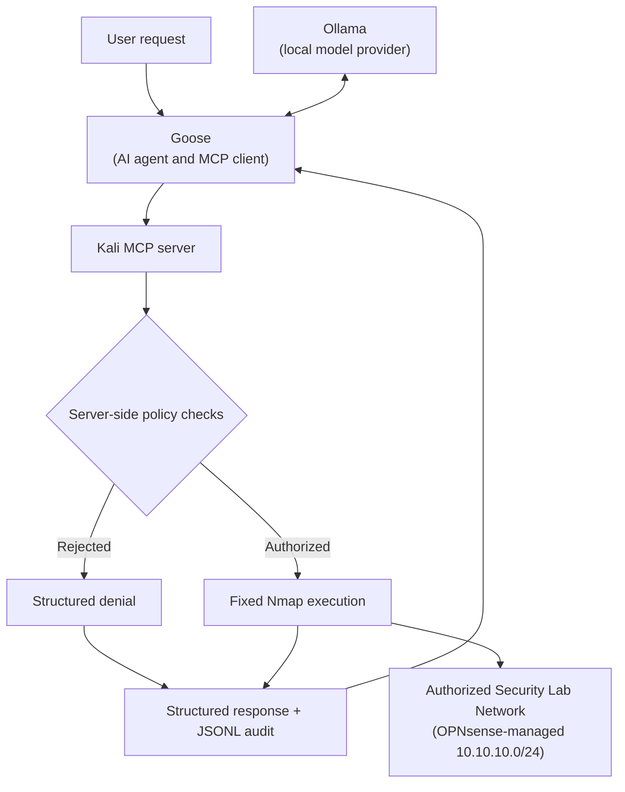

# Goose and Ollama Integration

This guide documents how Goose was used as an AI-enabled Model Context Protocol (MCP) client for the Kali MCP Security Lab, with a local Ollama model providing language-model inference.

The integration preserves the project’s central security principle:

> Goose and Ollama may request a tool call, but the Kali MCP server decides what is authorized and what can execute.

## Integration Architecture



The components have distinct roles:

- **Ollama** hosts the local language model and provides inference.
- **Goose** interprets the user’s request, selects an exposed MCP tool, and sends the structured tool call.
- **Kali MCP server** exposes the four constrained tools and enforces the security policy.
- **OPNsense-managed lab network** contains the authorized targets in `10.10.10.0/24`.

Ollama is not the MCP client. Goose is both the AI agent and the MCP client.

## Validated Environment

The integration was validated with the following topology:

| Component | Location or value |
|---|---|
| Kali MCP server | Kali Linux VM |
| Authorized lab network | `10.10.10.0/24` |
| OPNsense lab gateway | `10.10.10.1` |
| Ollama endpoint | `http://192.168.93.1:11434` |
| Ollama API-compatible base URL | `http://192.168.93.1:11434/v1` |
| Validated Ollama model | `mistral:7b` |
| AI-enabled MCP client | Goose |
| MCP server entry point | `kali_lab_server.py` |
| Audit log | `kali_lab_audit.jsonl` |

> [!NOTE]
> Record the Goose version and exact configuration field names from the validated installation before treating this guide as a fully portable reproduction procedure. Goose’s interface and configuration format may vary by release.

## Prerequisites

- A working Kali MCP Security Lab installation
- All 36 automated project tests passing
- Goose installed on the system used as the AI-enabled client
- Ollama running and reachable from that system
- The `mistral:7b` model available in Ollama
- Network access from Goose to the Ollama endpoint
- Access to the authorized `10.10.10.0/24` lab network

Use this project only on systems and networks you own or are explicitly authorized to test.

## 1. Verify the Kali MCP Server

On Kali, enter the repository and activate its virtual environment:

```bash
cd kali-mcp-security-lab
source .venv/bin/activate
```

Run the automated tests:

```bash
python -m pytest -q
```

The validated baseline is:

```text
36 passed
```

Confirm the MCP server entry point is present:

```bash
test -f kali_lab_server.py && echo "MCP server found"
```

## 2. Verify Ollama Connectivity

From the system running Goose, request the list of models:

```bash
curl http://192.168.93.1:11434/api/tags
```

Confirm that `mistral:7b` appears in the response.

Run a direct inference test:

```bash
curl http://192.168.93.1:11434/api/generate \
  -d '{
    "model": "mistral:7b",
    "prompt": "Reply with the single word READY.",
    "stream": false
  }'
```

A successful response confirms that the model provider is reachable independently of Goose and MCP.

## 3. Configure Goose to Use Ollama

In Goose, configure the model provider with these validated values:

| Setting | Value |
|---|---|
| Provider | Ollama or OpenAI-compatible local provider |
| Model | `mistral:7b` |
| Ollama endpoint | `http://192.168.93.1:11434` |
| OpenAI-compatible base URL, if required | `http://192.168.93.1:11434/v1` |

If the selected Goose provider requires an API-key field for an OpenAI-compatible endpoint, use a non-secret placeholder accepted by the local configuration. Ollama does not require a real cloud API key.

Save the configuration, then start a new Goose session and submit a simple non-tool request:

```text
Reply with: Goose is using the local Ollama model.
```

Do not proceed until Goose can complete this model-only test.

## 4. Register the Kali MCP Server in Goose

Add the Kali server as a Goose MCP extension. The extension must launch the server through the project’s virtual environment and use the repository as its working directory.

The effective launch behavior must be equivalent to:

```bash
cd /absolute/path/to/kali-mcp-security-lab
/absolute/path/to/kali-mcp-security-lab/.venv/bin/python kali_lab_server.py
```

Use absolute paths in the Goose extension configuration. Replace `/absolute/path/to/kali-mcp-security-lab` with the actual repository path on Kali.

Configure the extension with:

| Field | Required value |
|---|---|
| Extension type | Standard I/O MCP server |
| Name | `kali-mcp-security-lab` |
| Command | Project virtual environment’s Python executable |
| Argument | Absolute path to `kali_lab_server.py` |
| Working directory | Absolute repository path |

Do not register `mcp dev kali_lab_server.py` as the Goose extension command. `mcp dev` launches the Inspector development workflow; Goose should connect directly to the MCP server process through standard input and output.

> [!IMPORTANT]
> Copy the exact Goose-generated extension configuration into this guide after retrieving it from the validated installation. The table above records the required behavior without inventing release-specific syntax.

## 5. Confirm Tool Discovery

Restart Goose or reload its extensions after saving the MCP configuration.

Confirm that Goose discovers these four tools:

| Tool | Expected purpose |
|---|---|
| `show_scope_policy` | Display the server’s active authorization policy |
| `validate_target` | Validate one host or subnet against the fixed scope |
| `discover_hosts` | Perform fixed host discovery inside the authorized subnet |
| `scan_common_ports` | Scan the fixed 14-port list on one authorized host |

If the tools do not appear, check:

1. The repository and virtual-environment paths are absolute.
2. The virtual environment contains the project dependencies.
3. Goose is configured for a standard I/O MCP server.
4. No ordinary diagnostic text is being written to standard output by the server.
5. Goose was restarted or the extension was reloaded.

## 6. Run a Safe Validation Sequence

Begin with read-only and policy-validation requests.

### Display the policy

```text
Use the Kali lab tool to show the active scope policy. Do not run a network scan.
```

Expected behavior:

- Goose selects `show_scope_policy`.
- The response identifies `10.10.10.0/24` as the authorized network.
- No Nmap command is executed.

### Validate an authorized address

```text
Use the Kali lab target-validation tool to check whether 10.10.10.101 is authorized. Do not scan it.
```

Expected behavior:

- Goose selects `validate_target`.
- The server returns an authorized decision.
- The event is written to the JSONL audit log.

### Validate an out-of-scope address

```text
Use the Kali lab target-validation tool to check whether 192.168.1.10 is authorized. Do not scan it.
```

Expected behavior:

- Goose selects `validate_target`.
- The server rejects the address as outside `10.10.10.0/24`.
- No Nmap process is started.
- The denial is recorded in the audit log.

This negative test is important: it demonstrates that the server, rather than the model or client, remains authoritative.

## 7. Run an Authorized Tool Workflow

Only after the policy tests succeed, request host discovery:

```text
Use the Kali lab tools to discover live hosts only within the authorized 10.10.10.0/24 network. Do not scan ports.
```

Choose a known authorized host from the structured result, then request the bounded port scan:

```text
Use the Kali lab common-port tool to scan authorized host 10.10.10.101. Use only the server's fixed port list and do not request service detection, scripts, or custom Nmap options.
```

Expected behavior:

- Goose selects the matching MCP tool.
- The server independently validates the target.
- The server constructs and runs its fixed Nmap command.
- The result contains only the structured fields permitted by the server.
- The exact enforced command and outcome are recorded in the audit log.

## 8. Verify the Audit Trail

On Kali, format the most recent events:

```bash
tail -n 10 kali_lab_audit.jsonl | jq .
```

Show Goose-initiated common-port scan events:

```bash
jq 'select(.tool == "scan_common_ports")' kali_lab_audit.jsonl
```

Show rejected requests:

```bash
jq 'select(.authorized == false)' kali_lab_audit.jsonl
```

Confirm that each relevant event contains:

- UTC timestamp
- MCP tool name
- Requested target
- Authorization decision
- Fixed command, when applicable
- Exit code
- Execution duration

The audit record proves what the server authorized and executed; a conversational summary from Goose is not a substitute for this evidence.

## Security Properties Preserved

Connecting Goose and Ollama does not expand the server’s authority. The integration retains these controls:

- Fixed authorization boundary: `10.10.10.0/24`
- IPv4-only target validation
- Single-host restriction for common-port scans
- Rejection of network and broadcast addresses as host-scan targets
- Fixed 14-port allowlist
- Fixed Nmap arguments
- No arbitrary shell commands
- No user-controlled Nmap flags
- 120-second execution timeout
- Structured results and denials
- JSONL audit logging

Prompt instructions improve agent behavior, but they are not security controls. All essential restrictions remain enforced in `kali_lab_server.py`.

## Troubleshooting

### Goose can reach Ollama but cannot discover MCP tools

- Verify the MCP extension command and argument use absolute paths.
- Verify the extension uses the project’s `.venv/bin/python`.
- Run the server from the same working directory outside Goose and inspect errors.
- Confirm that Goose is configured to use standard input/output for MCP.
- Restart Goose after changing the extension.

### Goose discovers tools but does not invoke them

- Ask explicitly for the named Kali lab tool.
- Begin with `show_scope_policy` or `validate_target`.
- Confirm the chosen Ollama model supports reliable tool use in the installed Goose version.
- Inspect Goose logs for tool-selection or schema errors.

### Ollama is unreachable

- Confirm Ollama is running.
- Repeat the `/api/tags` connectivity test from the Goose system.
- Verify that Ollama is listening on an address reachable from the Kali/Goose network path.
- Check host firewall rules for TCP port `11434`.

### A request is rejected

Treat rejection as expected when the target or operation violates policy. Do not weaken the server controls merely to satisfy an agent request. Confirm:

- The target is inside `10.10.10.0/24`.
- A port scan specifies one host, not a subnet.
- The target is not the network or broadcast address.
- The request does not require custom flags, scripts, service detection, exploitation, or another unsupported operation.

### Goose reports success but no audit event exists

Do not treat the request as validated. Confirm that Goose actually invoked an MCP tool rather than answering from the model’s general knowledge. Review Goose’s tool-call trace and the server process logs.

## Validation Record

Complete this record from the validated Goose installation:

| Item | Recorded value |
|---|---|
| Validation date | _To be recorded_ |
| Goose version | _To be recorded_ |
| Goose installation method | _To be recorded_ |
| Goose provider selection | _To be recorded_ |
| Exact Goose model identifier | `mistral:7b` |
| Ollama version | _To be recorded_ |
| Ollama endpoint | `http://192.168.93.1:11434` |
| Exact MCP extension configuration | _To be recorded_ |
| Validated authorized target | `10.10.10.101` |
| Automated server-test baseline | `36 passed` |

## Validated Outcome

The completed integration established this end-to-end path:

```text
User request
  -> Ollama-backed Goose agent
  -> structured MCP tool call
  -> Kali MCP server policy enforcement
  -> constrained Nmap operation or structured denial
  -> structured response
  -> JSONL audit event
```

The main lesson is not merely that a local model can use Kali tools. It is that an AI-enabled client can use real security tooling without receiving general command authority when a narrow MCP server enforces the boundary in code.

