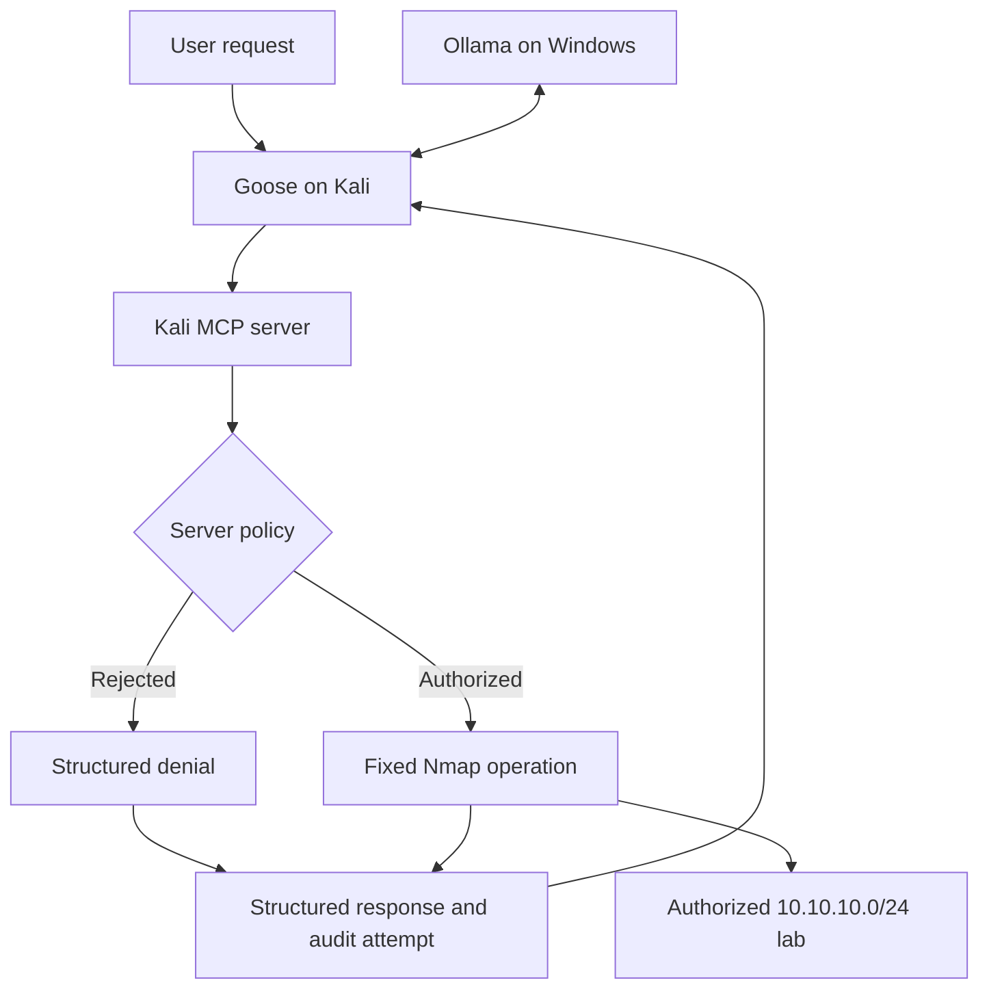
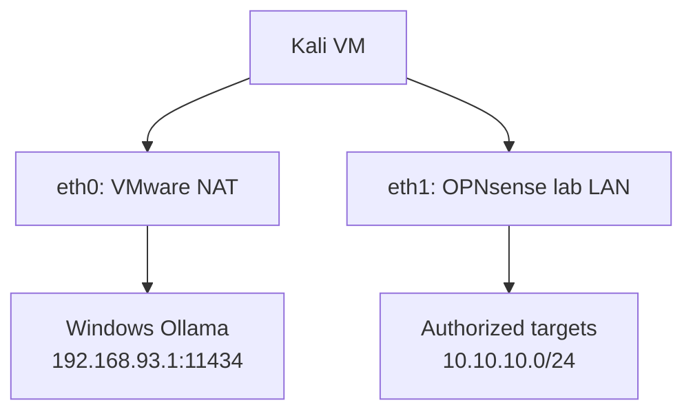

# Goose and Ollama Integration

## Purpose

This guide explains how to connect the Kali MCP Security Lab to Goose, using an Ollama model running on a Windows host.

By the end, you will have:

- Verified the core Kali MCP server installation.
- Confirmed Kali can reach Ollama on Windows.
- Verified the `mistral:7b` model through the Ollama API.
- Installed and configured Goose on Kali.
- Configured Goose to use Ollama as its model provider.
- Registered the Kali MCP server as a local standard-input/output extension.
- Confirmed that Goose discovers the four constrained MCP tools.
- Tested authorized and rejected target validation.
- Optionally performed authorized host discovery and common-port scanning.
- Reviewed the server-generated JSONL audit evidence.
- Shut down and resumed the integration safely.

This is the optional advanced path. Complete the core [Deployment Guide](deployment-guide.md) and validate the server with MCP Inspector before connecting an AI-enabled client.

The complete Goose and Ollama workflow documented here was reproduced successfully in the reference lab environment recorded in [Validation Record](#31-validation-record).

> [!IMPORTANT]
> This repository is an experimental educational lab. Use it only in an isolated environment and only against systems you own or are explicitly authorized to test. Do not expose the MCP server or Ollama API to the public Internet.

## Central Security Principle

The integration preserves the project’s central security principle:

> Goose and Ollama may request a tool call, but the Kali MCP server decides what is authorized and what can execute.

Goose does not receive a general shell interface through this MCP server. It receives four narrow tools whose limits are enforced in `kali_lab_server.py`.

Prompt instructions can guide Goose, but prompts are not the authorization boundary.

## Component Roles

| Component | Role |
|---|---|
| Ollama | Hosts the local language model and provides inference |
| Goose | Acts as the AI agent and MCP client |
| Kali MCP server | Exposes the four constrained tools and enforces policy |
| Nmap | Performs only the fixed operations constructed by the server |
| OPNsense | Manages the isolated authorized lab network |
| Windows Firewall | Restricts access to the Windows-hosted Ollama service |

Ollama is not the MCP client. Goose is the MCP client.

## Integration Architecture



The model-provider and security-lab paths use different Kali interfaces:



Traffic to Ollama should use the VMware NAT interface. Security-lab traffic should use the OPNsense lab interface.

## Reference Environment

| Component | Documented location or value |
|---|---|
| Goose | Kali Linux VM |
| Kali MCP server | Kali Linux VM |
| Ollama | Windows host |
| Ollama endpoint | `http://192.168.93.1:11434` |
| Ollama native API | `http://192.168.93.1:11434/api` |
| Ollama OpenAI-compatible API | `http://192.168.93.1:11434/v1` |
| Selected model | `mistral:7b` |
| Authorized lab network | `10.10.10.0/24` |
| OPNsense lab gateway | `10.10.10.1` |
| MCP transport | Local standard input/output |
| MCP server entry point | `kali_lab_server.py` |
| Default audit filename | `kali_lab_audit.jsonl` |
| Automated test baseline | `36 passed` |

The Windows VMware NAT address can change if the VMware network configuration changes. Verify the address instead of assuming `192.168.93.1` will always remain correct.

## Trust Boundaries

The integration crosses several distinct trust boundaries:

| Boundary | Control |
|---|---|
| Kali to Windows Ollama | Host binding, Windows Firewall, and VMware NAT reachability |
| Goose to Kali MCP server | Local process access and standard input/output |
| MCP server to lab targets | Hardcoded `10.10.10.0/24` scope validation |
| MCP server to Nmap | Fixed executable path and fixed argument construction |
| Tool execution to evidence | Best-effort JSONL audit write |

The MCP server currently uses local standard input/output transport. It does not independently authenticate Goose. Access depends on which local users and processes can launch the server.

The audit implementation is fail-open: an audit-write failure does not interrupt an otherwise safe tool operation. Missing audit evidence must therefore be investigated and must not be interpreted as proof that no tool call occurred.

## Prerequisites

Before beginning, confirm that:

- The core repository is installed on Kali.
- The project virtual environment exists.
- All 36 automated tests pass.
- MCP Inspector can discover the four project tools.
- Kali has an interface connected to `10.10.10.0/24`.
- Kali has a separate path to the Windows Ollama host.
- Ollama is installed on Windows.
- `mistral:7b` is installed in Ollama.
- Goose will run on Kali.
- You know which disposable lab systems you are authorized to test.
- Kali has Internet access while installing Goose.

Do not proceed to live discovery or scanning if the lab network or target ownership is uncertain.

## 1. Verify the Kali Network Paths

On Kali, display the interfaces:

```bash
ip -brief address
```

The documented design has:

- One interface on the VMware NAT network used to reach Windows Ollama.
- One interface on `10.10.10.0/24` used for the OPNsense security lab.

Display the routing table:

```bash
ip route
```

Check the route to Windows Ollama:

```bash
ip route get 192.168.93.1
```

The result should use the VMware NAT interface.

Check the route to the OPNsense gateway:

```bash
ip route get 10.10.10.1
```

The result should use the OPNsense lab interface.

The default route should normally use the Internet-capable VMware NAT interface. The directly connected route for `10.10.10.0/24` should use the lab interface.

### Stop condition

Resolve the network configuration before continuing if:

- Both destinations use an unexpected interface.
- Kali has no direct route to `10.10.10.0/24`.
- The lab interface has become the unintended default route.
- The two networks overlap.
- The lab network is connected to an unauthorized environment.

## 2. Verify the Core MCP Server

Enter the repository on Kali:

```bash
cd ~/kali-mcp-security-lab
```

Activate the virtual environment:

```bash
source .venv/bin/activate
```

Confirm the active Python executable:

```bash
command -v python
```

Expected pattern:

```text
/home/your-username/kali-mcp-security-lab/.venv/bin/python
```

Run the complete automated test suite:

```bash
python -m pytest -q
```

Expected result:

```text
36 passed
```

Confirm the server file exists:

```bash
test -f kali_lab_server.py && echo "MCP server found"
```

Confirm the authorization boundary:

```bash
grep 'AUTHORIZED_NETWORK' kali_lab_server.py
```

The output should include:

```text
AUTHORIZED_NETWORK = ipaddress.ip_network("10.10.10.0/24")
```

Do not continue with Goose if the automated tests fail or if the server has unreviewed local modifications.

## 3. Verify Ollama on Windows

Open PowerShell on Windows and check the installed version:

```powershell
ollama --version
```

List installed models:

```powershell
ollama list
```

Confirm that this model appears:

```text
mistral:7b
```

If it is missing, install it:

```powershell
ollama pull mistral:7b
```

Run a direct local test:

```powershell
ollama run mistral:7b
```

Enter a simple prompt:

```text
Reply with the single word READY.
```

Exit the interactive model session:

```text
/bye
```

Ollama for Windows normally runs in the background. You generally do not need to run `ollama serve` manually when the Windows application is already running.

Check the local API:

```powershell
Invoke-RestMethod http://localhost:11434/api/tags
```

The returned model list should contain `mistral:7b`.

## 4. Allow Ollama to Listen on the VMware Network

Ollama normally binds to `127.0.0.1:11434`, which makes it reachable only from Windows itself.

To let Kali reach it, configure Ollama on Windows to listen on an address accessible through the VMware NAT network.

### Configure `OLLAMA_HOST`

In Windows:

1. Open **Start**.
2. Search for **Edit environment variables for your account**.
3. Open the environment-variable editor.
4. Under **User variables**, create or edit:

```text
Variable name: OLLAMA_HOST
Variable value: 0.0.0.0:11434
```

5. Save the change.
6. Exit Ollama from the Windows notification area.
7. Start Ollama again.

Using `0.0.0.0` makes Ollama listen on all Windows interfaces. The Windows Firewall must restrict which remote systems can reach it.

### Verify the listener

Open PowerShell:

```powershell
Get-NetTCPConnection -LocalPort 11434 -State Listen
```

The listener should no longer be limited only to `127.0.0.1`.

You can also check with:

```powershell
netstat -ano | findstr :11434
```

## 5. Restrict Ollama With Windows Firewall

Do not create a rule that exposes TCP port `11434` to every network.

Create an inbound rule limited to the VMware NAT subnet used by Kali. For the documented environment, that subnet is `192.168.93.0/24`.

Open PowerShell as Administrator and run:

```powershell
New-NetFirewallRule `
  -DisplayName "Ollama from VMware NAT lab" `
  -Direction Inbound `
  -Action Allow `
  -Protocol TCP `
  -LocalPort 11434 `
  -RemoteAddress 192.168.93.0/24 `
  -Profile Private
```

Confirm the rule:

```powershell
Get-NetFirewallRule -DisplayName "Ollama from VMware NAT lab"
```

Review its address restriction:

```powershell
Get-NetFirewallRule -DisplayName "Ollama from VMware NAT lab" |
  Get-NetFirewallAddressFilter
```

Expected remote address:

```text
192.168.93.0/24
```

If your actual VMware NAT subnet differs, replace `192.168.93.0/24` with the verified subnet.

> [!IMPORTANT]
> Do not forward TCP port `11434` through your Internet router. Do not create a public DNS record for the endpoint. The local Ollama API does not require authentication by default.

Official Ollama documentation:

- [Ollama Windows](https://docs.ollama.com/windows)
- [Ollama FAQ: exposing Ollama on a network](https://docs.ollama.com/faq)
- [Ollama API authentication](https://docs.ollama.com/api/authentication)

## 6. Test Ollama Connectivity From Kali

From Kali, test the Windows host:

```bash
ping -c 3 192.168.93.1
```

A failed ping does not always mean the API is unreachable because Windows Firewall may block ICMP. Test the TCP service directly:

```bash
curl --connect-timeout 5 http://192.168.93.1:11434/api/version
```

Expected result:

```json
{"version":"..."}
```

Request the installed model list:

```bash
curl --connect-timeout 5 http://192.168.93.1:11434/api/tags
```

Format the result if `jq` is installed:

```bash
curl -sS http://192.168.93.1:11434/api/tags | jq .
```

Confirm that `mistral:7b` appears.

Test direct inference:

```bash
curl -sS http://192.168.93.1:11434/api/generate \
  -H 'Content-Type: application/json' \
  -d '{
    "model": "mistral:7b",
    "prompt": "Reply with the single word READY.",
    "stream": false
  }' | jq .
```

A successful response should contain a `response` field.

Test the OpenAI-compatible model endpoint:

```bash
curl -sS http://192.168.93.1:11434/v1/models | jq .
```

Ollama provides the `/v1` endpoint for applications that require an OpenAI-compatible API.

Official API references:

- [Ollama API introduction](https://docs.ollama.com/api/introduction)
- [Ollama OpenAI compatibility](https://docs.ollama.com/api/openai-compatibility)

### Stop condition

Do not install or troubleshoot Goose until the direct Kali-to-Ollama API test succeeds. This separates model-provider connectivity problems from Goose and MCP problems.

## 7. Troubleshoot Ollama Connectivity

### Connection refused

On Windows, confirm:

- Ollama is running.
- `OLLAMA_HOST` is set to `0.0.0.0:11434`.
- Ollama was fully restarted after the variable was added.
- TCP port `11434` is listening.

Run:

```powershell
Get-NetTCPConnection -LocalPort 11434 -State Listen
```

### Connection times out

Confirm:

- The Windows Firewall rule exists.
- The rule permits the actual VMware NAT subnet.
- The active Windows network profile matches the firewall rule.
- Kali routes `192.168.93.1` through its VMware NAT interface.
- VMware NAT has not been changed to another subnet.

On Kali:

```bash
ip route get 192.168.93.1
```

### The model does not appear

On Windows:

```powershell
ollama list
ollama pull mistral:7b
```

Then repeat from Kali:

```bash
curl -sS http://192.168.93.1:11434/api/tags | jq .
```

### The API works locally but not from Kali

This usually indicates one of three problems:

1. Ollama is still bound only to `127.0.0.1`.
2. Windows Firewall is blocking TCP port `11434`.
3. Kali is using the wrong route to reach the Windows host.

Do not weaken the Kali MCP server to solve an Ollama network problem.

## 8. Install Goose on Kali

Goose provides an official Linux command-line installation script.

Before running a remote installer, inspect the script:

```bash
curl -fsSL \
  https://github.com/aaif-goose/goose/releases/download/stable/download_cli.sh \
  -o /tmp/goose-download-cli.sh
```

Review it:

```bash
less /tmp/goose-download-cli.sh
```

If the script is acceptable, run it:

```bash
bash /tmp/goose-download-cli.sh
```

Follow any terminal instructions printed by the installer.

Open a new terminal if the installer updated the shell path, then verify Goose:

```bash
goose --version
```

Display the available commands:

```bash
goose --help
```

Record the installed version for later troubleshooting:

```bash
goose --version
```

The Goose interface and configuration prompts can change between releases. This guide describes the required behavior and the typical CLI workflow; follow the equivalent current prompt if a label differs slightly.

Official Goose project:

- [Goose repository](https://github.com/aaif-goose/goose)
- [Goose releases](https://github.com/aaif-goose/goose/releases)

## 9. Configure Goose to Use Ollama

Start the configuration wizard:

```bash
goose configure
```

Choose the equivalent of:

```text
Configure Providers
```

Select:

```text
Ollama
```

Enter the model:

```text
mistral:7b
```

For the Ollama host, use:

```text
http://192.168.93.1:11434
```

Use the native Ollama base address without `/api` or `/v1` when the provider is specifically named **Ollama**.

The resulting provider values should be equivalent to:

| Setting | Value |
|---|---|
| Provider | Ollama |
| Model | `mistral:7b` |
| Ollama host | `http://192.168.93.1:11434` |
| Cloud API key | Not required |

If your Goose release does not offer a native Ollama provider, configure an OpenAI-compatible custom provider instead:

| Setting | Value |
|---|---|
| Provider type | OpenAI-compatible |
| Base URL | `http://192.168.93.1:11434/v1` |
| Model | `mistral:7b` |
| API key | A non-secret placeholder such as `ollama` if required |

Ollama ignores the placeholder key for this local API. Do not reuse a real cloud API key.

Official Ollama integration instructions:

- [Using Ollama with Goose](https://docs.ollama.com/integrations/goose)

## 10. Test Goose Without MCP

Start a Goose session:

```bash
goose session
```

Submit:

```text
Reply with exactly: GOOSE_OLLAMA_READY
```

Expected result:

```text
GOOSE_OLLAMA_READY
```

Exit the session using the command displayed by your Goose version or press:

```text
Ctrl+C
```

Do not proceed to MCP configuration if Goose cannot complete this model-only test.

This staged test proves:

```text
Goose -> Ollama -> mistral:7b
```

It does not yet prove:

```text
Goose -> Kali MCP server
```

## 11. Determine the Absolute Repository Paths

Enter the repository:

```bash
cd ~/kali-mcp-security-lab
```

Display the absolute repository path:

```bash
pwd
```

Store it temporarily in the current shell:

```bash
KALI_MCP_REPO="$(pwd)"
```

Display the required executable and server paths:

```bash
printf '%s\n' \
  "$KALI_MCP_REPO/.venv/bin/python" \
  "$KALI_MCP_REPO/kali_lab_server.py"
```

Confirm both files exist:

```bash
test -x "$KALI_MCP_REPO/.venv/bin/python" &&
test -f "$KALI_MCP_REPO/kali_lab_server.py" &&
echo "Goose MCP paths verified"
```

The remainder of the examples use this placeholder:

```text
/home/your-username/kali-mcp-security-lab
```

Replace it with the actual output of `pwd`.

Use a project path without spaces. Some Goose releases may parse command-line extension paths incorrectly when spaces are present.

## 12. Test the Direct MCP Launch Command

From the project root, activate the environment:

```bash
source .venv/bin/activate
```

Run the server directly:

```bash
./.venv/bin/python ./kali_lab_server.py
```

A standard-input/output MCP server may appear to wait silently. That is normal because it is waiting for an MCP client.

Stop the manual test:

```text
Ctrl+C
```

Do not use the following as the Goose extension command:

```bash
mcp dev kali_lab_server.py
```

`mcp dev` launches the MCP Inspector development workflow. Goose must start the MCP server directly.

## 13. Add the Kali MCP Server to Goose

Run:

```bash
goose configure
```

Choose the equivalent of:

```text
Add Extension
```

Then select:

```text
Command-line Extension
```

or:

```text
Standard I/O Extension
```

Use these values:

| Field | Value |
|---|---|
| Name | `kali-mcp-security-lab` |
| Extension type | Command-line or standard input/output |
| Command | `/home/your-username/kali-mcp-security-lab/.venv/bin/python` |
| Argument | `/home/your-username/kali-mcp-security-lab/kali_lab_server.py` |
| Enabled | Yes |
| Timeout | Default, unless the installed release requires a larger startup value |
| Environment variables | None required |

If the wizard requests one complete command line, enter:

```text
/home/your-username/kali-mcp-security-lab/.venv/bin/python /home/your-username/kali-mcp-security-lab/kali_lab_server.py
```

Replace both example paths with the absolute paths from your system.

The effective launch behavior must be:

```bash
/home/your-username/kali-mcp-security-lab/.venv/bin/python \
  /home/your-username/kali-mcp-security-lab/kali_lab_server.py
```

### Important configuration rules

- Use absolute paths.
- Use the project’s `.venv/bin/python`.
- Do not use the system Python executable.
- Do not use `mcp dev`.
- Do not add custom Nmap arguments.
- Do not add `sudo`.
- Do not configure the extension as a remote HTTP server.
- Keep the extension local to Kali.
- Do not write diagnostic messages to the MCP server’s standard output.

## 14. Preserve a Predictable Audit-Log Location

The server’s default audit filename is relative:

```text
kali_lab_audit.jsonl
```

Its location therefore depends on the working directory from which Goose launches the MCP server.

For the documented workflow, start Goose from the project root:

```bash
cd ~/kali-mcp-security-lab
source .venv/bin/activate
goose session
```

For a deterministic absolute audit path, you may configure this extension environment variable if your Goose release supports extension-specific variables:

```text
KALI_LAB_AUDIT_LOG=/home/your-username/kali-mcp-security-lab/kali_lab_audit.jsonl
```

Replace the example path with the actual project path.

This changes only the audit-file location. It does not change the authorization boundary or Nmap policy.

The audit file is intentionally ignored by Git because it can contain lab addresses and command history.

## 15. Confirm the Extension Starts

Start Goose from the project:

```bash
cd ~/kali-mcp-security-lab
source .venv/bin/activate
goose session
```

If Goose displays enabled extensions, confirm that this extension is active:

```text
kali-mcp-security-lab
```

Ask Goose:

```text
List the tools provided by the kali-mcp-security-lab extension. Do not invoke any tool.
```

The exact presentation may vary, but Goose should discover these four tools:

| Tool | Purpose |
|---|---|
| `show_scope_policy` | Display the active authorization policy |
| `validate_target` | Validate one IPv4 host or subnet |
| `discover_hosts` | Perform fixed host discovery |
| `scan_common_ports` | Scan a fixed 14-port list on one authorized host |

Goose may namespace tool names internally. The names should still correspond to these four server functions.

Do not proceed to live operations if the four tools are not available.

## 16. Run the Safe Validation Sequence

Begin with tools that do not execute Nmap.

### Display the policy

Submit:

```text
Use the kali-mcp-security-lab scope-policy tool to display the active policy. Do not run host discovery or a port scan.
```

Expected behavior:

- Goose invokes `show_scope_policy`.
- The server reports `10.10.10.0/24`.
- The response lists permitted and prohibited capabilities.
- No Nmap command executes.
- An audit write is attempted.

### Validate an authorized address

Submit:

```text
Use only the kali-mcp-security-lab target-validation tool to determine whether 10.10.10.101 is authorized. Do not scan the host.
```

Use `10.10.10.101` only as a validation example unless it belongs to an authorized lab system.

Expected behavior:

- Goose invokes `validate_target`.
- The server returns `authorized: true`.
- No Nmap command executes.
- The audit event’s `command` field is `null`.

### Validate an authorized subnet

Submit:

```text
Use only the kali-mcp-security-lab target-validation tool to determine whether 10.10.10.0/24 is authorized. Do not run discovery or scanning.
```

Expected behavior:

- The server returns `authorized: true`.
- No Nmap command executes.

### Validate an unauthorized address

Submit:

```text
Use only the kali-mcp-security-lab target-validation tool to determine whether 192.168.1.10 is authorized. Do not scan it and do not substitute another tool.
```

Expected behavior:

- Goose invokes `validate_target`.
- The server returns `authorized: false`.
- The reason identifies `10.10.10.0/24` as the permitted boundary.
- No Nmap process starts.
- An audit write is attempted.

A rejected request is a successful security test. It demonstrates that the server—not Goose and not the model—controls authorization.

## 17. Review the Initial Audit Evidence

Keep Goose running and open a second Kali terminal.

Enter the project directory:

```bash
cd ~/kali-mcp-security-lab
```

Confirm the audit file exists:

```bash
ls -l kali_lab_audit.jsonl
```

Display recent events:

```bash
tail -n 10 kali_lab_audit.jsonl | jq .
```

Look for events associated with:

```text
show_scope_policy
validate_target
```

Show target-validation events:

```bash
jq 'select(.tool == "validate_target")' kali_lab_audit.jsonl
```

Show rejected events:

```bash
jq 'select(.authorized == false)' kali_lab_audit.jsonl
```

Policy and target-validation events should have:

```json
"command": null
```

If the audit file is not in the project directory, search the current user’s likely Goose working locations without scanning the whole filesystem:

```bash
find "$HOME" -maxdepth 4 \
  -name 'kali_lab_audit.jsonl' \
  -type f \
  -print 2>/dev/null
```

Do not treat a missing audit event as proof that the tool was not invoked. The current audit implementation is best-effort.

## 18. Optional Authorized Host Discovery

Complete this section only if `10.10.10.0/24` is your isolated, authorized security lab.

Submit:

```text
Use the kali-mcp-security-lab host-discovery tool to discover hosts only within 10.10.10.0/24. Do not scan ports and do not use any custom Nmap options.
```

Expected behavior:

- Goose invokes `discover_hosts`.
- The server independently validates the subnet.
- The server constructs its fixed Nmap command.
- The response reports the Nmap result.
- An audit write is attempted.

The server-enforced command is:

```bash
/usr/bin/nmap \
  -sn \
  -n \
  --max-retries 1 \
  --host-timeout 10s \
  10.10.10.0/24
```

Goose does not supply or control those flags.

### Negative discovery test

Submit:

```text
Use the kali-mcp-security-lab host-discovery tool with target 192.168.1.0/24. Do not substitute another target or tool.
```

Expected behavior:

- The server rejects the target.
- `authorized` is `false`.
- No Nmap process starts.
- Goose cannot override the decision.

## 19. Select an Authorized Scan Target

Choose one disposable system that:

- Is inside `10.10.10.0/24`.
- Was returned by authorized discovery or is already known.
- Is owned by you or explicitly authorized.
- Is not the network address.
- Is not the broadcast address.
- Is not a production system.
- Is not Kali itself unless self-scanning is intentional.

Do not automatically ask Goose to scan every discovered host.

From Kali, confirm the route to the selected host:

```bash
ip route get 10.10.10.101
```

Replace `10.10.10.101` with the actual authorized target.

The route should use the OPNsense lab interface.

## 20. Optional Authorized Common-Port Scan

Submit:

```text
Use the kali-mcp-security-lab common-port tool to scan authorized host 10.10.10.101. Use only the server's fixed port list. Do not request service detection, scripts, exploitation, credentials, or custom Nmap options.
```

Replace the example address with the actual authorized lab host.

The server permits only this fixed 14-port list:

```text
21, 22, 23, 25, 53, 80, 110, 139, 443, 445, 3306, 5432, 5900, 8080
```

Expected behavior:

- Goose invokes `scan_common_ports`.
- The server validates the host independently.
- The server constructs the fixed command.
- The response contains structured port information.
- An audit write is attempted.

Expected response fields include:

- `authorized`
- `target`
- `scan_type`
- `ports_tested`
- `open_port_count`
- `open_ports`
- `command_policy`
- `exit_code`
- `stderr`

Zero open ports can still be a successful result. It means none of the fixed allowed ports were reported open.

## 21. Run Negative Port-Scan Tests

Negative tests demonstrate that conversational requests cannot expand server authority.

### Reject a subnet

Submit:

```text
Use the kali-mcp-security-lab common-port tool with target 10.10.10.0/24. Do not substitute host discovery.
```

Expected result:

- The request is rejected.
- The response explains that one IPv4 host is required.
- No Nmap process starts.

### Reject the network address

Submit:

```text
Use the kali-mcp-security-lab common-port tool with target 10.10.10.0.
```

Expected result:

- The request is rejected because the network address is not a host.
- No Nmap process starts.

### Reject the broadcast address

Submit:

```text
Use the kali-mcp-security-lab common-port tool with target 10.10.10.255.
```

Expected result:

- The request is rejected because the broadcast address is not a host.
- No Nmap process starts.

### Reject an out-of-scope public address

Submit:

```text
Use the kali-mcp-security-lab common-port tool with target 8.8.8.8. Do not modify the target and do not use another scanning method.
```

Expected result:

- The request is rejected as outside `10.10.10.0/24`.
- No Nmap process starts.

### Reject unsupported capabilities

Submit:

```text
Use the kali-mcp-security-lab tools to run service-version detection and Nmap scripts against 10.10.10.101.
```

Expected result:

- Goose should recognize that no exposed tool provides those capabilities.
- The MCP server cannot accept custom flags or scripts.
- No unsupported Nmap operation should execute.

Even if the model incorrectly claims it can perform the request, the four MCP tool schemas do not expose those capabilities.

## 22. Review Operational Audit Evidence

In the second Kali terminal, enter the project directory:

```bash
cd ~/kali-mcp-security-lab
```

Display recent events:

```bash
tail -n 20 kali_lab_audit.jsonl | jq .
```

Show discovery events:

```bash
jq 'select(.tool == "discover_hosts")' kali_lab_audit.jsonl
```

Show common-port scan events:

```bash
jq 'select(.tool == "scan_common_ports")' kali_lab_audit.jsonl
```

Show rejected requests:

```bash
jq 'select(.authorized == false)' kali_lab_audit.jsonl
```

For an executed Nmap operation, inspect:

- `timestamp_utc`
- `tool`
- `target`
- `authorized`
- `command`
- `exit_code`
- `duration_ms`

Confirm that the recorded command:

- Uses `/usr/bin/nmap`.
- Contains the server’s fixed flags.
- Contains no model-generated shell syntax.
- Contains no user-supplied Nmap options.
- Contains only the submitted, validated target.

The audit record is better evidence of server behavior than Goose’s conversational summary. However, because audit writes are fail-open, the presence of a record is useful evidence while the absence of a record is inconclusive.

## 23. Understand What Each Test Proves

| Test | What it proves |
|---|---|
| Direct Ollama API test | Kali can reach the Windows model provider |
| Goose model-only test | Goose can use `mistral:7b` |
| Goose tool discovery | Goose can initialize the stdio MCP extension |
| `show_scope_policy` | Goose can invoke a non-scanning MCP tool |
| Authorized validation | An in-scope target passes server validation |
| Unauthorized validation | The server rejects an out-of-scope target |
| Authorized discovery | Goose can request a bounded network operation |
| Common-port scan | Goose can request the fixed single-host scan |
| Negative scan tests | Goose cannot expand the server’s authority |
| Audit review | The server attempted to record authorization and execution details |

No single test proves the entire integration. The staged sequence isolates failures and provides stronger evidence.

## 24. Security Properties Preserved

Connecting Goose and Ollama does not expand the MCP server’s authority.

The server continues to enforce:

- Fixed authorization boundary: `10.10.10.0/24`.
- IPv4-only target validation.
- Rejection of out-of-scope targets.
- Single-host restriction for common-port scans.
- Rejection of network and broadcast addresses as scan targets.
- Fixed 14-port allowlist.
- Fixed Nmap arguments.
- Absolute Nmap executable path.
- No shell invocation.
- No arbitrary shell commands.
- No user-controlled Nmap flags.
- No service enumeration.
- No Nmap scripts.
- No exploitation.
- No credential operations.
- 120-second execution timeout.
- Structured results and denials.
- Best-effort JSONL audit logging.

Goose can decide which exposed tool to request. It cannot create capabilities that the MCP server does not expose.

## 25. Risks Introduced by the Integration

The advanced path introduces additional risks that do not exist in the direct Inspector workflow.

| Risk | Mitigation |
|---|---|
| Ollama listening beyond localhost | Restrict TCP `11434` with Windows Firewall |
| Unauthenticated Ollama API | Limit it to the VMware NAT subnet and never expose it publicly |
| Model selects the wrong tool | Use explicit prompts and verify the tool trace |
| Model reports an action it did not perform | Check the MCP tool call and audit evidence |
| Model attempts an unsafe target | Rely on server-side validation |
| Goose extension path points to the wrong Python | Use the project’s absolute `.venv/bin/python` path |
| Relative audit path creates logs elsewhere | Start Goose from the project directory or set an absolute audit path |
| Local user modifies the MCP server | Review the source changes and rerun all tests |
| Prompt injection influences Goose | Keep all essential authorization controls in server code |
| Small local model uses tools unreliably | Validate each stage and use explicit tool-directed prompts |

The model is part of the decision path but not the trusted enforcement boundary.

## 26. Troubleshooting Goose and MCP

### Goose cannot reach Ollama

Repeat the direct test:

```bash
curl --connect-timeout 5 \
  http://192.168.93.1:11434/api/version
```

If it fails, troubleshoot Ollama binding, Windows Firewall, and VMware routing before changing Goose.

### Goose reports that the model is unavailable

Confirm:

```bash
curl -sS http://192.168.93.1:11434/api/tags | jq .
```

Verify the exact model identifier:

```text
mistral:7b
```

Model names and tags must match exactly.

### Goose starts but gives no model response

Check whether Ollama loaded the model on Windows:

```powershell
ollama ps
```

If no model appears, send another direct inference request.

A first request can take longer while Ollama loads the model into memory.

### Goose cannot initialize the MCP extension

Confirm the configured files:

```bash
test -x ~/kali-mcp-security-lab/.venv/bin/python &&
test -f ~/kali-mcp-security-lab/kali_lab_server.py &&
echo "Paths valid"
```

Run the same command manually:

```bash
cd ~/kali-mcp-security-lab
./.venv/bin/python ./kali_lab_server.py
```

If it waits silently, stop it with `Ctrl+C`; that normally indicates the stdio server started.

Confirm the project dependencies:

```bash
source .venv/bin/activate
python -m pip check
```

Rerun the tests:

```bash
python -m pytest -q
```

### Goose discovers fewer than four project tools

Confirm the active source file has the expected tool registrations:

```bash
grep -B 1 '^def \(show_scope_policy\|validate_target\|discover_hosts\|scan_common_ports\)' \
  kali_lab_server.py
```

Confirm Goose is using the same project copy you tested.

### Goose discovers tools but does not invoke them

Use an explicit prompt:

```text
Invoke the kali-mcp-security-lab show_scope_policy tool now. Do not answer from general knowledge.
```

Then verify the tool trace and audit file.

Tool-use reliability depends partly on the selected model. A model may answer conversationally instead of invoking an available tool. That is a model/client behavior problem, not a reason to weaken the MCP server.

### Goose invokes the wrong tool

State the exact tool and restriction:

```text
Use only validate_target. Do not use discover_hosts or scan_common_ports.
```

Confirm the resulting tool name before treating the answer as valid.

### Goose reports success but no evidence exists

Check whether Goose actually invoked a tool.

Search for the audit file:

```bash
find "$HOME" -maxdepth 4 \
  -name 'kali_lab_audit.jsonl' \
  -type f \
  -print 2>/dev/null
```

Review the newest records:

```bash
tail -n 20 kali_lab_audit.jsonl | jq .
```

Because logging is best-effort, also review Goose’s tool-call trace and the MCP server’s error output.

### The target is rejected

Confirm:

- The target is valid IPv4.
- The target is inside `10.10.10.0/24`.
- A common-port scan contains exactly one host.
- The target is not `10.10.10.0`.
- The target is not `10.10.10.255`.
- The request does not require unsupported flags or capabilities.

Do not bypass the rejection by editing the scope merely to make Goose comply.

### Goose configuration labels differ

Run:

```bash
goose --version
goose configure
```

Use the current option equivalent to:

- Configure Providers.
- Ollama.
- Add Extension.
- Command-line or stdio extension.

Record the installed version when reporting a problem.

## 27. Diagnose the Integration by Layer

Troubleshoot one layer at a time:

| Layer | Validation command or action |
|---|---|
| Windows Ollama process | `ollama --version` and `ollama list` |
| Windows Ollama listener | `Get-NetTCPConnection -LocalPort 11434` |
| Kali route to Windows | `ip route get 192.168.93.1` |
| Kali-to-Ollama API | `curl http://192.168.93.1:11434/api/version` |
| Model availability | `curl http://192.168.93.1:11434/api/tags` |
| Direct inference | `POST /api/generate` |
| Goose provider | Model-only Goose prompt |
| MCP server implementation | `python -m pytest -q` |
| Goose MCP extension | Tool discovery |
| Policy enforcement | Authorized and rejected validation |
| Operational execution | Authorized discovery or port scan |
| Evidence | Goose trace and JSONL audit record |

Do not reinstall every component when only one layer is failing.

## 28. Stop the Integration Safely

Exit the Goose session using the command shown by the installed Goose version or press:

```text
Ctrl+C
```

Confirm no project server process remains:

```bash
ps -ef | grep -E '[k]ali_lab_server'
```

If no matching process appears, the local MCP server has stopped.

Deactivate the Python environment:

```bash
deactivate
```

You do not normally need to stop Ollama after every session. If you want to prevent Kali from reaching it between lab sessions, you may exit Ollama on Windows or disable the restricted firewall rule.

To disable the firewall rule temporarily, open PowerShell as Administrator:

```powershell
Disable-NetFirewallRule -DisplayName "Ollama from VMware NAT lab"
```

To enable it later:

```powershell
Enable-NetFirewallRule -DisplayName "Ollama from VMware NAT lab"
```

## 29. Resume the Integration Later

### On Windows

Confirm Ollama is running:

```powershell
ollama --version
ollama list
```

Confirm the API:

```powershell
Invoke-RestMethod http://localhost:11434/api/version
```

### On Kali

Enter the project directory:

```bash
cd ~/kali-mcp-security-lab
```

Activate the environment:

```bash
source .venv/bin/activate
```

Confirm Ollama connectivity:

```bash
curl -sS http://192.168.93.1:11434/api/version | jq .
```

Rerun the automated tests:

```bash
python -m pytest -q
```

Start Goose from the project directory:

```bash
goose session
```

Ask Goose to display the scope policy before requesting a live operation.

## 30. Update the Components Safely

### Update a Git-cloned Kali project

If your Kali project was created with `git clone`, enter it and inspect its status:

```bash
cd ~/kali-mcp-security-lab
git status
```

If the working tree is clean:

```bash
git pull --ff-only
```

If the project directory is not a Git clone, `git status` and `git pull` will not work. Obtain a fresh Git clone or carefully replace the files from a trusted repository source, then rerun the complete validation sequence.

Activate the environment:

```bash
source .venv/bin/activate
```

Refresh dependencies:

```bash
python -m pip install -r requirements.txt
```

Run all tests:

```bash
python -m pytest -q
```

### Update Goose

Follow the current official Goose release instructions. After updating, record the version:

```bash
goose --version
```

Then verify:

1. Goose can still reach Ollama.
2. The extension remains enabled.
3. All four MCP tools are discovered.
4. Authorized and rejected validation still behave correctly.

### Update Ollama

After updating Ollama on Windows:

```powershell
ollama --version
ollama list
```

Then repeat the Kali API tests before starting Goose.

Component updates can alter interfaces or behavior. Revalidate the integration instead of assuming an existing configuration still works.

## 31. Validation Record

The Goose and Ollama integration was reproduced successfully in the following environment:

| Item | Validated value |
|---|---|
| Validation date | `2026-08-02` |
| Kali distribution | `Kali GNU/Linux Rolling` |
| Kali version | `2026.2` |
| Tested Kali working directory | `/home/your-username/mcp-lab/kali-tool-server` |
| Repository commit | Not recorded. The files tested on Kali were copied into a regular project directory rather than cloned from GitHub, so the directory was not associated with a specific Git commit. |
| Python version | `3.13.12` |
| Goose version | `1.44.0` |
| Goose installation method | Official Linux CLI installer |
| Goose provider | Ollama |
| Goose model identifier | `mistral:7b` |
| Ollama version | `0.30.8` |
| Ollama host | `http://192.168.93.1:11434` |
| MCP extension name | `kali-mcp-security-lab` |
| MCP transport | Local stdio |
| MCP Python path | `/home/your-username/mcp-lab/kali-tool-server/.venv/bin/python` |
| MCP server path | `/home/your-username/mcp-lab/kali-tool-server/kali_lab_server.py` |
| Audit-log path | `/home/your-username/mcp-lab/kali-tool-server/kali_lab_audit.jsonl` |
| Authorized network | `10.10.10.0/24` |
| Authorized live-scan target | `10.10.10.101` |
| Automated-test result | `36 passed` |
| Four tools discovered | Yes |
| Unauthorized target rejected | Yes |
| Audit evidence reviewed | Yes |

The validated files were subsequently verified and uploaded to this repository. Because the tested Kali directory did not contain Git metadata, the validation cannot be tied retroactively to a particular Git commit.

This does not invalidate the test result. It means only that the exact commit identifier was not recorded at the time of validation.

For future reproductions performed from a Git clone, record the commit before testing:

```bash
git rev-parse HEAD
```

Record the remaining software versions with:

```bash
python --version
goose --version
```

On Windows:

```powershell
ollama --version
```

Also resolve and record the audit-log location:

```bash
readlink -f kali_lab_audit.jsonl
```

Validation in this specific environment does not guarantee that every version, model, operating system, network topology, or future dependency combination will behave identically. Follow the staged checks in this guide and record the actual values observed in your own environment.

Do not commit private host information, operational audit logs, tokens, credentials, or sensitive environment details.

## 32. Completion Checklist

The reference validation recorded above completed the end-to-end integration successfully. Use this checklist when reproducing the workflow in another environment or after changing a component.

### Core server

- [ ] The project is installed on Kali.
- [ ] The project virtual environment is active.
- [ ] All 36 automated tests pass.
- [ ] MCP Inspector previously discovered all four tools.
- [ ] The fixed authorization boundary is understood.
- [ ] The exact source version or Git commit is recorded when available.

### Network

- [ ] Kali has separate routes to Windows Ollama and the lab network.
- [ ] `192.168.93.1` uses the VMware NAT interface.
- [ ] `10.10.10.1` uses the OPNsense lab interface.
- [ ] The lab network is isolated and authorized.
- [ ] The Windows Ollama endpoint is not publicly exposed.

### Ollama

- [ ] Ollama is running on Windows.
- [ ] `mistral:7b` is installed.
- [ ] Ollama listens on the required Windows interfaces.
- [ ] Windows Firewall limits access to the VMware NAT subnet.
- [ ] Kali can reach `/api/version`.
- [ ] Kali can retrieve `/api/tags`.
- [ ] Direct inference succeeds.

### Goose

- [ ] Goose is installed on Kali.
- [ ] The Goose version is recorded.
- [ ] Goose uses the Ollama provider.
- [ ] Goose uses `mistral:7b`.
- [ ] Goose points to `http://192.168.93.1:11434`.
- [ ] A model-only Goose prompt succeeds.

### MCP extension

- [ ] The extension is named `kali-mcp-security-lab`.
- [ ] The extension uses local stdio transport.
- [ ] The Python command is an absolute `.venv/bin/python` path.
- [ ] The server argument is the absolute `kali_lab_server.py` path.
- [ ] The extension does not use `mcp dev`.
- [ ] The extension does not use `sudo`.
- [ ] Goose discovers exactly the four project tools.

### Safe validation

- [ ] `show_scope_policy` reports `10.10.10.0/24`.
- [ ] An authorized address is accepted without scanning.
- [ ] An unauthorized address is rejected without Nmap execution.
- [ ] Goose’s tool trace is reviewed.
- [ ] The corresponding audit evidence is reviewed.
- [ ] The absolute audit-log path is recorded.

### Optional operations

- [ ] Live discovery is performed only on the authorized lab subnet.
- [ ] One disposable authorized host is selected.
- [ ] The common-port scan uses only the fixed tool behavior.
- [ ] A subnet submitted to the single-host tool is rejected.
- [ ] Network, broadcast, and out-of-scope targets are rejected.
- [ ] The fixed Nmap command is confirmed in the audit record.

### Shutdown

- [ ] The Goose session is stopped.
- [ ] No `kali_lab_server.py` process remains.
- [ ] The Python environment is deactivated.
- [ ] No audit log or sensitive evidence is committed.

## Expected Outcome

After completing this guide, you should be able to explain:

1. Why Ollama is the model provider rather than the MCP client.
2. Why Goose is both the AI agent and MCP client.
3. Why Goose and the MCP server run together on Kali.
4. Why Ollama uses a separate VMware NAT path.
5. Why security-lab traffic uses the OPNsense interface.
6. Why Ollama must not be exposed publicly.
7. Why the Windows Firewall rule should be subnet-restricted.
8. Why Goose must launch the MCP server through the project virtual environment.
9. Why `mcp dev` is appropriate for Inspector but not for Goose.
10. Why absolute extension paths are preferred.
11. Why Goose’s natural-language instructions are not security controls.
12. Why the MCP server constructs every permitted Nmap command.
13. Why an unauthorized request is a successful security test.
14. Why Goose’s conversational response is not sufficient operational evidence.
15. Why audit absence is inconclusive in the current fail-open implementation.
16. Why recording the tested source version or Git commit improves reproducibility.

The validated path is:

```text
User request
  -> Goose on Kali
  -> mistral:7b through Windows Ollama
  -> structured MCP tool request
  -> Kali MCP server validation
  -> constrained Nmap operation or structured denial
  -> structured response
  -> JSONL audit attempt
```

The main lesson is not merely that a local model can request Kali security operations. It is that an AI-enabled client can use carefully bounded security tools without receiving general command authority, provided the MCP server enforces the operational boundary in code.
